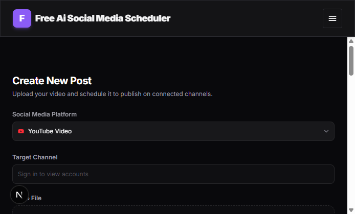
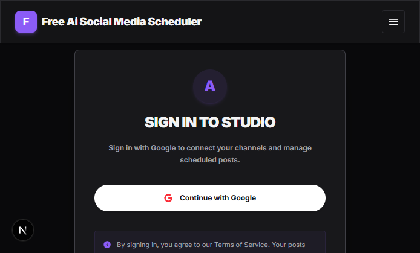
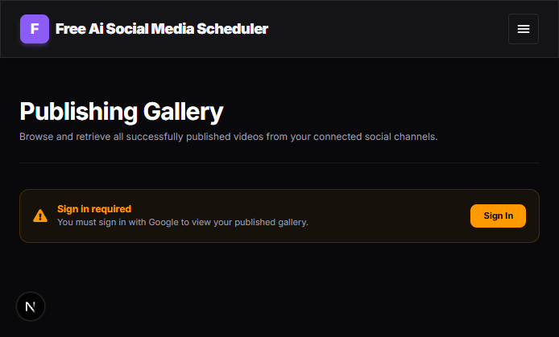
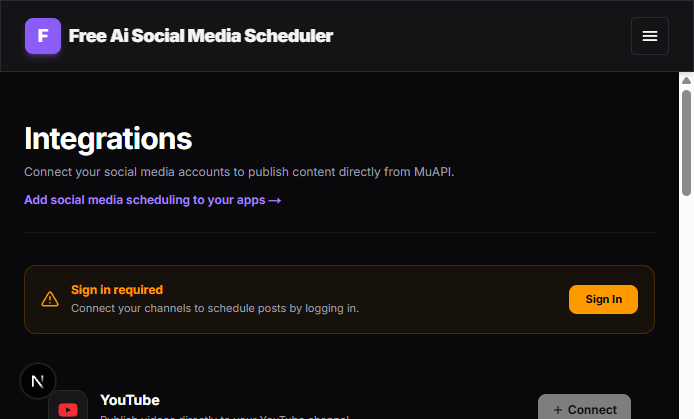
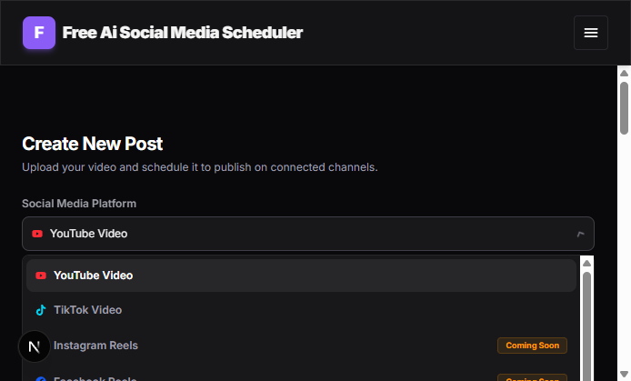
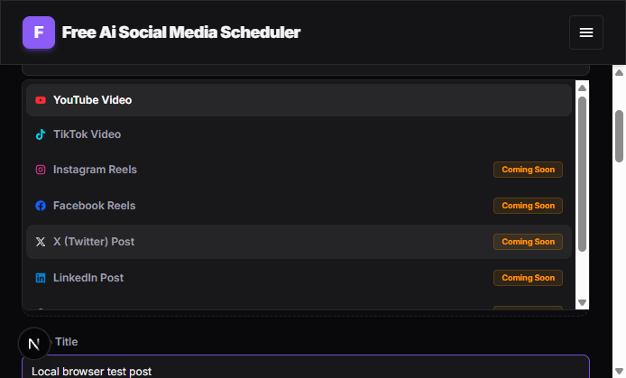

# Website E2E Test Report

## Summary

| Item | Result |
|---|---|
| Website | `http://localhost:3000` |
| Test Date | 2026-09-08 |
| Browser | Chromium via Playwright |
| Overall Result | PARTIAL |

## Executive Summary

The local website loaded successfully and rendered the workspace, login, Gallery, and Integrations pages. Basic workspace interaction also worked: the platform selector opened and a video title could be entered. The main authenticated workflow could not be completed because Google OAuth returned `Error 400: redirect_uri_mismatch` after the Sign In button was clicked.

## Test Environment

- Browser: Chromium via Playwright
- URL: `http://localhost:3000`
- Application version: `0.1.0`
- Environment: Local Next.js development server with local PostgreSQL configured
- Authentication: Google OAuth

## Test Scenarios

### Scenario 1 — Homepage and workspace render

**Status:** PASS

#### Steps

1. Opened `http://localhost:3000`.
2. Observed the Create New Post workspace.
3. Confirmed the YouTube platform selector, target channel control, upload area, metadata fields, scheduling controls, preview, and scheduler queue were visible.

#### Expected Result

The local application should load without a blank screen and render the main workspace.

#### Actual Result

The workspace rendered successfully. Local resources and `/api/auth/session` returned HTTP 200 during navigation. A clean reload completed without console errors or failed requests.

#### Evidence



### Scenario 2 — Google sign-in

**Status:** BLOCKED

#### Steps

1. Opened `/login`.
2. Clicked `Continue with Google`.
3. Waited for the OAuth result page.

#### Expected Result

Google should display the account authorization flow and redirect back to `http://localhost:3000` after successful authentication.

#### Actual Result

Google blocked the request and displayed `Error 400: redirect_uri_mismatch`. The app could not create an authenticated session.

#### Evidence




#### Diagnostics

```text
Google response: Error 400: redirect_uri_mismatch
OAuth callback requested by the app: http://localhost:3000/api/auth/callback/google
```

### Scenario 3 — Guest Gallery access

**Status:** PASS

#### Steps

1. Opened `/gallery` without an authenticated session.
2. Observed the page state.

#### Expected Result

The Gallery should clearly require sign-in rather than showing another user’s content.

#### Actual Result

The page displayed `Sign in required` and explained that Google sign-in is needed to view published videos.

#### Evidence



### Scenario 4 — Guest Integrations access

**Status:** PASS

#### Steps

1. Opened `/integrations` without an authenticated session.
2. Observed the available platform cards.

#### Expected Result

Account connection actions should require authentication, and unavailable platforms should be identified clearly.

#### Actual Result

The page displayed a sign-in requirement. YouTube and TikTok were shown as active integrations with disabled Connect buttons while logged out. Instagram, X, Facebook, LinkedIn, Threads, and Pinterest were marked Coming soon.

#### Evidence



### Scenario 5 — Workspace form interaction

**Status:** PASS

#### Steps

1. Opened the workspace.
2. Opened the Social Media Platform selector.
3. Confirmed YouTube and TikTok options were available.
4. Confirmed future platforms were marked Coming Soon.
5. Entered `Local browser test post` into the Video Title field.

#### Expected Result

The selector should open and the title field should accept user input.

#### Actual Result

The selector opened and the title was accepted. The preview updated to show the entered title. Publishing remained unavailable because no authenticated target channel and no uploaded video were present.

#### Evidence





## Failures

### Google OAuth redirect URI mismatch

**Severity:** High

**Observed behavior:**

Clicking `Continue with Google` navigated to Google’s error page with `Error 400: redirect_uri_mismatch`.

**Expected behavior:**

The configured Google OAuth client should accept the local callback and return the user to the application.

**Likely cause:**

The Google Cloud OAuth client does not contain this exact authorized redirect URI:

```text
http://localhost:3000/api/auth/callback/google
```

**Evidence:**


**Diagnostics:**

```text
Google: Error 400: redirect_uri_mismatch
```

### Stale credit label in workspace

**Severity:** Medium

**Observed behavior:**

The publish button still displays `Publish Now (1 Credit)` even though the local-only backend no longer checks or deducts credits.

**Expected behavior:**

The button should say `Publish Now` in local mode.

**Evidence:**


## Evidence Index

| Screenshot | Description |
|---|---|
| `01-homepage.png` | Initial workspace |
| `02-login.png` | Local login page |
| `03-google-oauth-failure.png` | Google OAuth redirect error |
| `04-gallery-guest.png` | Gallery authentication guard |
| `05-integrations-guest.png` | Integrations authentication guard |
| `06-platform-selector.png` | Platform selector opened |
| `07-form-filled.png` | Workspace title input and preview update |

## Final Assessment

The local UI is functional for unauthenticated browsing and basic form interaction. The requested end-to-end publishing flow cannot be considered verified because Google authentication is blocked by the OAuth configuration. Publishing, account connection, upload, scheduling, and Gallery content could not be tested as an authenticated user.

The application is not production-ready based on this test. The stale credit label should also be removed to match the local-only backend behavior.

## Recommended Next Steps

1. Add `http://localhost:3000/api/auth/callback/google` to the Google OAuth client’s Authorized redirect URIs.
2. Restart the development server and rerun the Google sign-in scenario.
3. Remove the `1 Credit` text from the publish button.
4. After authentication works, test account connection, video upload, immediate publishing, scheduling, failure handling, and Gallery results.