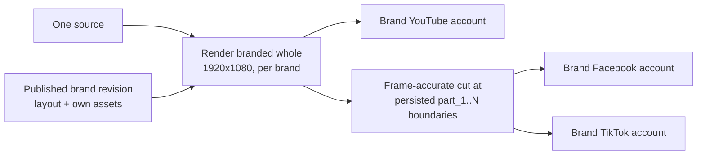
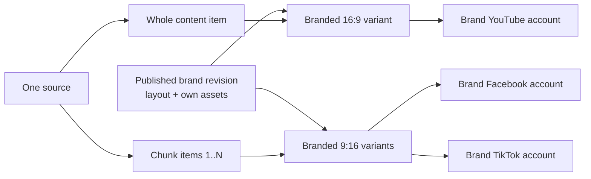
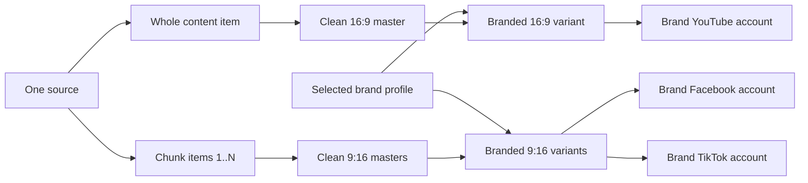

# Delivery contract

This file is the authoritative mapping from one source and campaign revision to
platform delivery units.

## Mapping

| Platform | Unit | Asset | Metadata/operator action |
|---|---|---|---|
| YouTube | one per source/account | branded whole 16:9 video + thumbnail | generated title, description, hashtags, and thumbnail text |
| Facebook Page | one per chunk/account | branded 16:9 landscape chunk | generated caption/hashtags; worker later adds configured comments |
| TikTok | one per chunk/account | same-brand 16:9 landscape chunk | operator copies prepared caption/hashtags and completes the draft |

For `N` chunks and selected platform-account counts:

```text
target_count = youtube_accounts
             + (N * facebook_accounts)
             + (N * tiktok_accounts)
```

For the first fixture, one brand profile contains one account per platform. A
three-chunk source therefore creates seven targets: 1 YouTube + 3 Facebook + 3
TikTok.

## Current landscape-chunk delivery

For every selected brand, render one complete branded 1920x1080 video first.
Cut that completed file at the persisted balanced, sentence-safe `part_<n>`
boundaries, using a frame-accurate re-encode. Each resulting 1920x1080 chunk
records the branded whole asset as `lineage_asset_id`; the chunk therefore has
the exact same subtitles, voice, watermark, and signature music as YouTube at
the corresponding moment. Facebook and TikTok reuse that same-brand chunk.

New renders use a versioned landscape-chunk manifest contract. Existing v1
vertical manifests/files remain immutable history and are never delivery inputs
for a new render revision.



One brand's landscape chunk is the single delivery asset for that brand's
Facebook and TikTok targets of the same part. It is never shared across brands,
because each brand renders its own whole.

### Platform preflight for a 1920x1080 chunk

| Platform | Route | Landscape rule |
|---|---|---|
| YouTube | whole upload | 16:9 is the native shape; unchanged |
| Facebook Page | Page video | Reels are portrait-only, so a landscape chunk posts as a Page video. A Reel route that rejects the asset must fall back, not fail the target |
| TikTok | upload to inbox draft | The Upload API states H.264 MP4 and 360-4096 px per dimension with no portrait-only rule, so 1920x1080 is expected to be accepted |

Both Facebook and TikTok rows are read from published platform documentation
and are **unverified against a real account**. A sandbox or private preflight
must record an actual provider response before any publish capability ships.

## Historical v1 topologies

Two render topologies produce the same delivery units. A manifest states which
one it used in its `topology` field.

### `brand_owned` — a `brand.v1` layout (current)



The brand owns the whole layout: the rectangle the source footage sits in, the
blur regions, the stills, the presenter and its alpha, the text layers, the
subtitle style, and the signature music. Nothing is shared between brands, so
each delivery asset is rendered once, directly from the source, for that brand.
There is no clean master and no `lineage_asset_id`. The manifest records the
published brand revision behind every asset in `brand_revisions`.

### `clean_lineage` — library presets and mock brand profiles (legacy)



Here the brand profile supplies only the watermark and signature music, and the
clean master is brand-neutral so several brands can be dressed from one render.
Every branded asset must reference its clean master through `lineage_asset_id`.

Under both historical topologies the branded 9:16 asset was reusable between
Facebook and TikTok only when both targets belonged to the same brand. The
same-brand rule survives into `landscape_chunks`; only the asset's shape
changed.

## Invariants

- A YouTube target references a `WHOLE_VIDEO`, a 16:9 branded asset, and
  whole-video metadata from the approved revision.
- A Facebook or TikTok target references a `CHUNK`, a 16:9 branded landscape
  chunk asset, and
  that chunk's approved platform metadata.
- Chunks are ordered, unique, non-overlapping, and named `part_<1-based index>`.
- A Facebook comment action belongs to one successful Facebook target.
- A TikTok draft reaching the inbox is delivered, not publicly published.
- Every target includes the campaign revision in its idempotency key.
- No target may run before the complete revision is approved.
- A manifest states its `schema_version` and its `topology`. A new render is
  always `media-manifest.v2` / `landscape_chunks`. `media-manifest.v1` with
  `clean_lineage` or `brand_owned` is readable history only.
- Under `landscape_chunks` a brand contributes exactly one `branded_whole` for
  `whole` and one `branded_landscape_chunk` per `part_<n>`, every one of them
  1920x1080. There is no clean master and no vertical asset.
- Every `branded_landscape_chunk` carries a `lineage_asset_id` naming its own
  brand's `branded_whole`. A chunk whose lineage names another brand's whole,
  or names nothing, is not a delivery asset.
- A cut whose measured duration does not match its persisted `chunks` span
  fails that chunk alone. A missing or corrupt whole fails every chunk derived
  from it, and the revision stays `needs_action` until all of them validate.
- Under `clean_lineage` every branded asset carries a `lineage_asset_id` naming
  its clean master; under `brand_owned` there are no clean assets, no lineage,
  and `brand_revisions` names the exact published brand revision used for each
  brand.
- A brand-owned render job names an explicit brand revision, or asks for
  `"latest"` and is answered with the number it resolved to. A draft brand is
  never a valid render input, and the resolved number — never the word — is
  what the manifest records.

