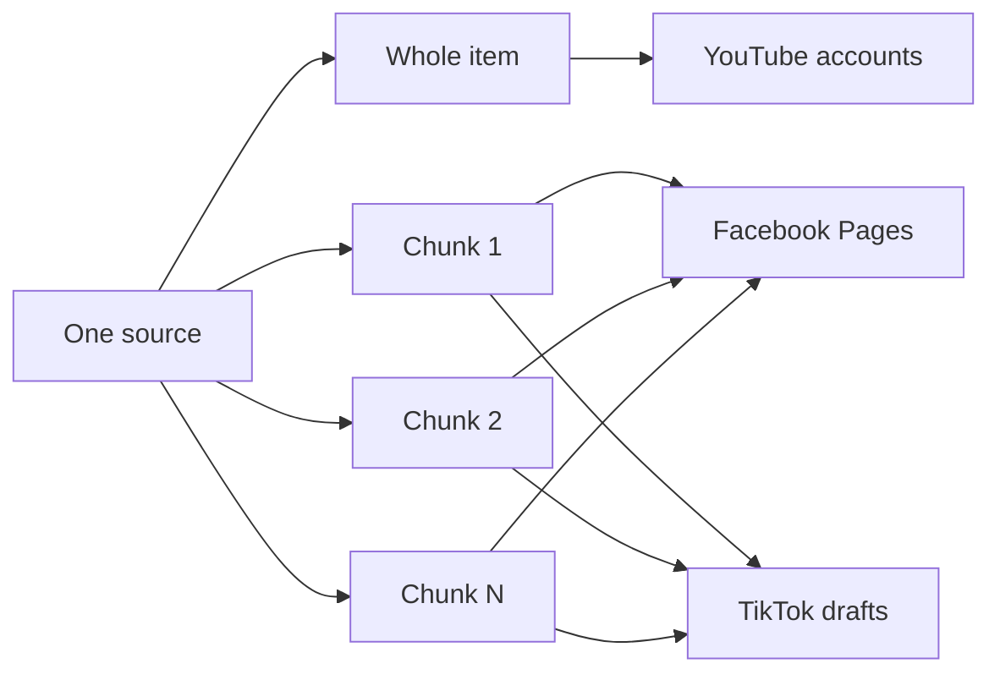

# Delivery contract

This file is the authoritative mapping from one rendered source to platform
delivery units.

## Mapping

| Platform | Unit | Asset | Operator action after API delivery |
|---|---|---|---|
| YouTube | one per source/account | whole 16:9 video + thumbnail | none after successful publish |
| Facebook Page | one per chunk/account | 9:16 chunk | none; worker adds configured comment actions |
| TikTok | one per chunk/account | 9:16 chunk | open inbox draft, apply prepared metadata/cover, publish |

For `N` chunks:

```text
target_count = youtube_accounts
             + (N × facebook_accounts)
             + (N × tiktok_accounts)
```

Example: three chunks and one selected account on each platform create seven
targets: 1 YouTube + 3 Facebook + 3 TikTok.

## Invariants

- A YouTube target must reference a `WHOLE_VIDEO` content item and 16:9 asset.
- A Facebook or TikTok target must reference a `CHUNK` content item and 9:16
  asset.
- A Facebook comment action belongs to one successful Facebook target.
- A TikTok draft reaching the inbox is delivered, not publicly published.
- Every target includes the campaign revision in its idempotency key.



