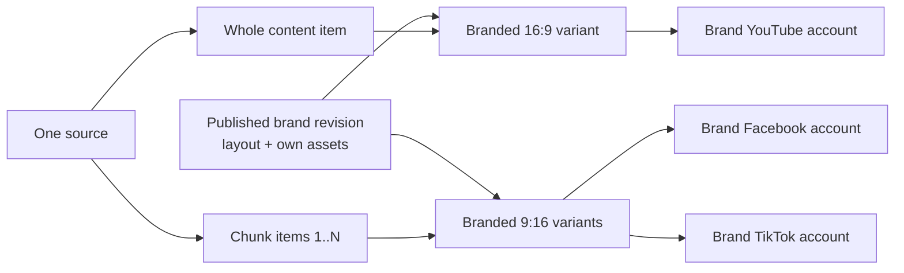
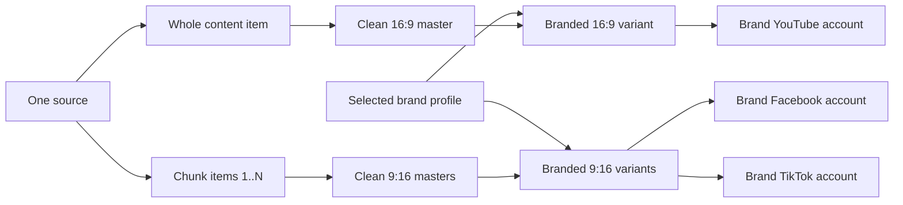

# Delivery contract

This file is the authoritative mapping from one source and campaign revision to
platform delivery units.

## Mapping

| Platform | Unit | Asset | Metadata/operator action |
|---|---|---|---|
| YouTube | one per source/account | branded whole 16:9 video + thumbnail | generated title, description, hashtags, and thumbnail text |
| Facebook Page | one per chunk/account | branded 9:16 chunk | generated caption/hashtags; worker later adds configured comments |
| TikTok | one per chunk/account | same-brand 9:16 chunk | operator copies prepared caption/hashtags and completes the draft |

For `N` chunks and selected platform-account counts:

```text
target_count = youtube_accounts
             + (N * facebook_accounts)
             + (N * tiktok_accounts)
```

For the first fixture, one brand profile contains one account per platform. A
three-chunk source therefore creates seven targets: 1 YouTube + 3 Facebook + 3
TikTok.

## Brand and asset relationship

Two render topologies produce the same delivery units. A manifest states which
one it used in its `topology` field.

### `brand_owned` — a `brand.v1` layout (current)



The brand owns the whole layout: the rectangle the source footage sits in, the
blur regions, the stills, the presenter and its alpha, the text layers, the
subtitle style, and the signature music. Nothing is shared between brands, so
each delivery asset is rendered once, directly from the source, for that brand.
There is no clean master and no `lineage_asset_id`. The manifest records the
published brand revision behind every asset in `brand_revisions`.

### `clean_lineage` — library presets and mock brand profiles (legacy)



Here the brand profile supplies only the watermark and signature music, and the
clean master is brand-neutral so several brands can be dressed from one render.
Every branded asset must reference its clean master through `lineage_asset_id`.

Under either topology the branded 9:16 asset may be reused between Facebook and
TikTok only when both targets belong to the same brand.

## Invariants

- A YouTube target references a `WHOLE_VIDEO`, a 16:9 branded asset, and
  whole-video metadata from the approved revision.
- A Facebook or TikTok target references a `CHUNK`, a 9:16 branded asset, and
  that chunk's approved platform metadata.
- Chunks are ordered, unique, non-overlapping, and named `part_<1-based index>`.
- A Facebook comment action belongs to one successful Facebook target.
- A TikTok draft reaching the inbox is delivered, not publicly published.
- Every target includes the campaign revision in its idempotency key.
- No target may run before the complete revision is approved.
- A manifest states its `topology`. Under `clean_lineage` every branded asset
  carries a `lineage_asset_id` naming its clean master; under `brand_owned`
  there are no clean assets, no lineage, and `brand_revisions` names the exact
  published brand revision used for each brand.
- A brand-owned render job names an explicit brand revision. A draft brand or an
  unversioned "latest" is never a valid render input.

