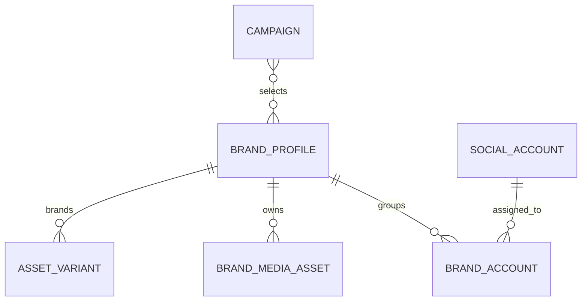
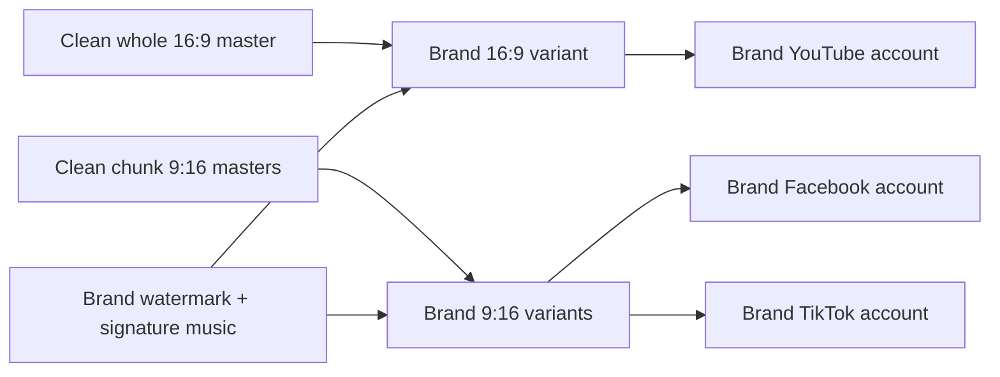
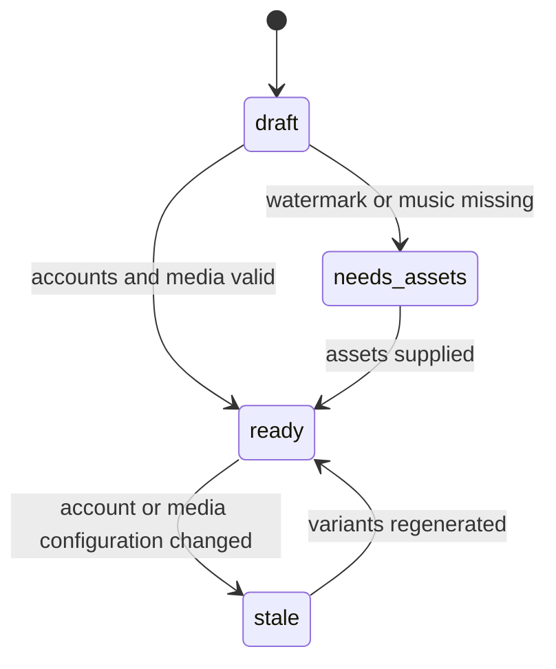

# Brand profiles and branded media variants

Status: proposed
Priority: P0 contract, P1 persistence
Depends on: core data model and social account vault; mock profile may precede them
Consumed by: rendering, review, target fan-out

## Outcome

Select one brand profile and consistently apply its social accounts, watermark,
and signature music to both the YouTube 16:9 video and Facebook/TikTok 9:16
chunks.

## Relationships

For the first MVP, one mock brand profile groups one YouTube, one Facebook, and
one TikTok account. The design permits later profiles and additional accounts
without mixing credentials or assets between brands.

## Render flow

Signature music is mixed as a quiet background bed. Its gain is calibrated per
brand against the narrator rather than copied across music tracks. For `an-so`,
the confirmed mix is `volume_db: -7.9`, yielding 44 % of narration while speech
is present and 45 % in pauses. `ratio: 1.0` deliberately disables ducking, so
the bed stays flat; the compressor remains in the graph because the schema
requires that shape. Music loops for the complete asset, fades in for `0.75 s`,
and fades out for `1.0 s`. A frequency-isolated fixture verifies that the music
remains present after the source music duration and fades at both asset
boundaries.

An optional music-only peak control can prevent a musical crescendo from
overpowering the bed. It reads only the post-gain music track in fixed RMS
windows and applies a smoothed gain envelope before the music/voice mix. The
operator tried it for `an-so` but selected the flat 45 % bed instead, so its
draft has no peak-control setting. When enabled for another brand, the setting
is part of the immutable brand revision and never uses the voice as a trigger.

## State lifecycle

## Edge cases and recovery

| Case | Behavior | User recovery |
|---|---|---|
| Signature music or watermark missing | Do not silently publish a wrongly branded variant | Add/replace asset and resume rendering |
| Brand config changes after approval | Invalidate approval and branded variants | Regenerate and request approval again |
| One social account needs reconnect | Keep peer accounts healthy but block complete temporary group approval | Reconnect or remove that target in a new revision |
| Facebook and TikTok share one brand | Reuse the same branded 9:16 file | No duplicate render required |
| Different brands use the same source | Derive separate branded variants | Track each by brand and revision |

## Done when

A mock brand produces one branded 16:9 whole asset and N branded 9:16 assets
with its watermark and signature music, and the same configuration generates the
correct grouped targets without cross-brand paths or credentials.
