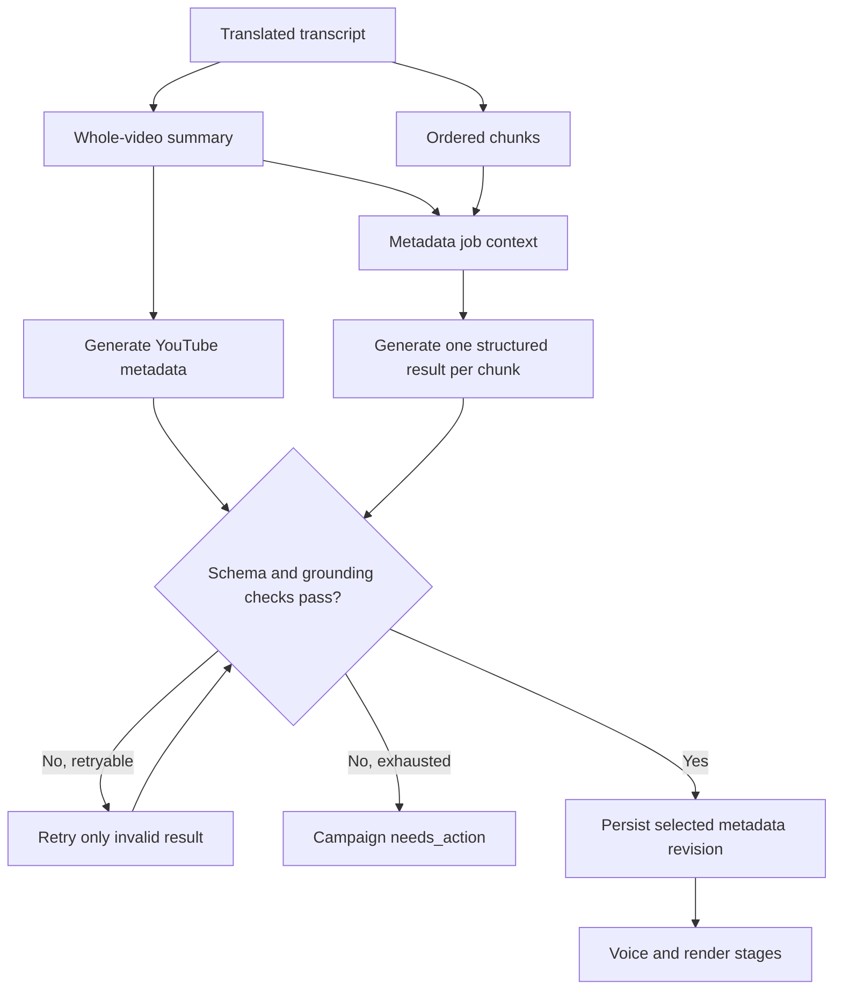
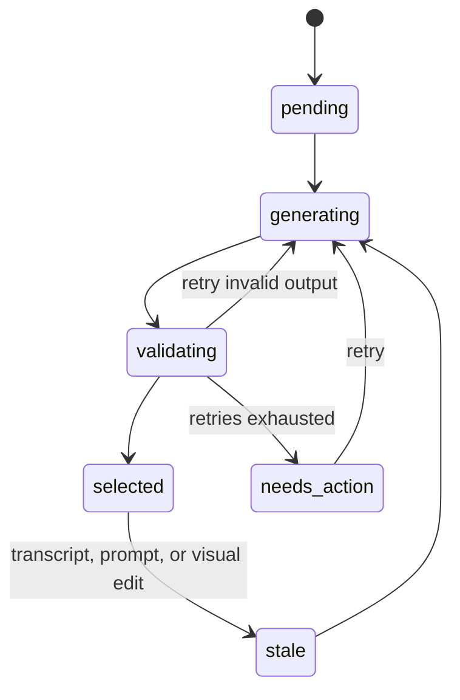
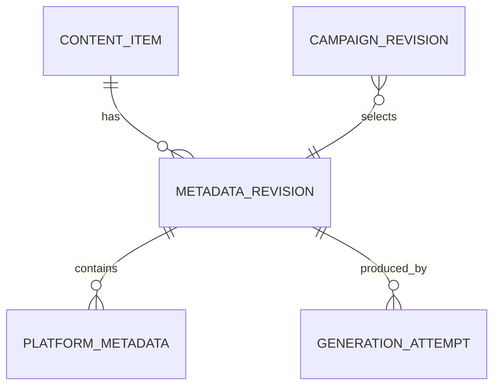

# Chunk and whole-video metadata generation

Status: in progress
Priority: P0
Depends on: translation and chunking
Consumed by: rendering, review inbox, YouTube, Facebook, TikTok

## Outcome

Generate source-grounded, editable metadata for the whole YouTube video and for
every Facebook/TikTok chunk before review.

The default output language is Vietnamese. Copy should be curiosity-driven and
engaging without misleading the viewer: hooks cannot invent events, results,
quotes, urgency, or promises not supported by the transcript and whole-video
summary. Each platform metadata object may contain zero, one, or two relevant
emojis; emojis are optional and never substitute for clear text.

## Outputs

- Whole video: YouTube title, description, hashtags, and thumbnail text.
- Every chunk: visual hook, supporting visual caption, Facebook caption and
  hashtags, TikTok caption and hashtags.
- Every platform metadata object contains exactly five hashtags: three
  content-specific tags plus two relevant broad/discovery tags. A hashtag never
  contains whitespace after `#`.
- Generation provenance: model, prompt version, transcript hash, response ID,
  token usage, generation time, validation status, and revision.
- The selected model is `gpt-5.6-luna`, explicitly approved on 2026-09-10.
  Validate it on fixed fixtures for schema compliance, Vietnamese quality,
  grounding, retries, and measured cost before production use. Record the
  per-campaign cost ceiling after those measurements.
- Live verification on 2026-09-10 passed with `reasoning.effort: none`. A
  read-only fixture containing one whole-video result and three chunk results
  used 10,048 input tokens and 1,412 output tokens, with an estimated cost of
  `$0.003704` at the then-current official token rates.

## Processing flow



## State lifecycle



## Data relationships



The current SQLite `chunks.hook`, `chunks.caption`, and `hashtags_json` fields
prove the renderer already expects chunk text, but one ambiguous caption field
cannot represent separate visual, Facebook, and TikTok metadata with revision
history. The durable app model should make those purposes explicit.

## Architecture decision

n8n should call a small Docker metadata service after chunking and before voice
or render. The service owns OpenAI prompts, Structured Output schemas, retries,
validation, provenance, and idempotency. Use one retryable generation unit per
content item so one invalid chunk does not regenerate successful peers. The
service reads `OPENAI_API_KEY` from its server-only container environment.

## Metadata service API

```text
POST /metadata/jobs              -> queue or reuse one active job
GET  /jobs/{job_id}              -> queued/running/done/failed + typed result
GET  /metadata/revisions/{id}    -> selected outputs + safe attempt/token evidence
```

The revision response never contains the API key, source transcript, request
prompt, or rejected generated body. It exposes response IDs, configured and
resolved model names, token usage, typed error codes, and selected output.

When a chunk result is selected, only `hook` and `visual_caption` are copied to
the renderer's compatibility fields. Facebook and TikTok captions remain
separate in the selected metadata revision. A newer generated revision marks
the previous revision stale and invalidates old chunk renders.

## Edge cases and recovery

| Case | Behavior | User recovery |
|---|---|---|
| One chunk returns invalid JSON or the wrong hashtag count | Retry only that chunk | Inspect failure after retries |
| Output adds unsupported claims | Fail grounding validation | Regenerate or edit manually |
| Hook is engaging but misleading | Fail claim/grounding validation | Regenerate or rewrite from supported details |
| More than two emojis are returned | Fail schema/style validation for that item | Retry only that item |
| OpenAI is unavailable/rate-limited | Backoff without duplicating results | Resume from metadata stage |
| n8n repeats a job request after losing the HTTP response | Reuse the active metadata job | Poll the returned job ID |
| Service restarts during generation | Close the running attempt and preserve selected peers | Retry metadata stage |
| Transcript changes | Mark derived metadata stale | Regenerate before rendering/approval |
| Post caption edit | Create new campaign revision | No rerender; request approval again |
| Visual hook/caption edit | Mark affected render stale | Rerender, validate, request approval again |

## Done when

A fixture with N chunks produces one valid YouTube metadata object and exactly N
valid chunk metadata objects with five valid hashtags each; invalid output is
retried safely; all generated copy is Vietnamese, grounded, and limited to two
relevant emojis per platform object; edits create a new revision; and no OpenAI
key appears in workflow JSON, logs, or the database.
