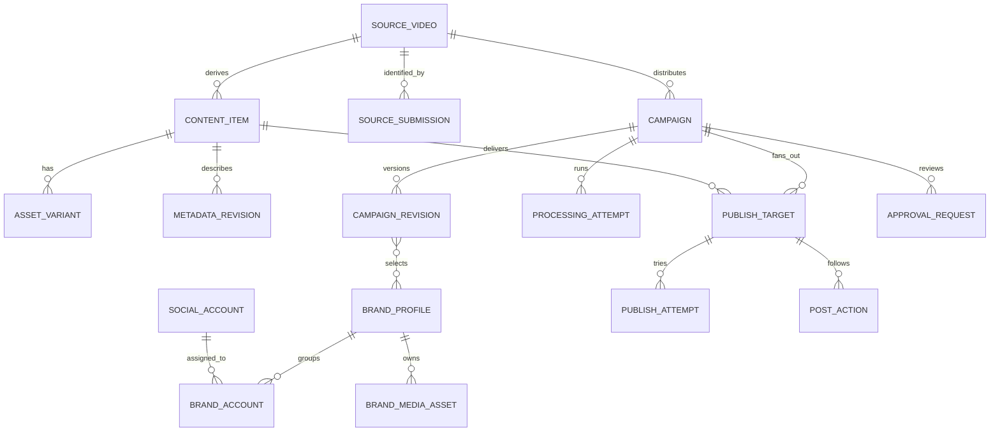

# Core data model

Priority: P1  
Depends on: foundation contract

## What it is

Replace the overloaded `ScheduledPost` concept with durable sources,
submissions, content/metadata revisions, brand profiles, variants, campaigns,
processing attempts, targets, publish attempts, post-actions, approvals, and
events in PostgreSQL.

## How it works

One `SourceVideo` can receive multiple submissions and campaigns. A failed
attempt does not blacklist the source. `WHOLE_VIDEO` has no chunk index;
`CHUNK` does. Campaign revisions select metadata, brands, and variants.
Processing/publishing attempts and post-actions are append-only children.

## Important information

- Additive migrations must preserve existing `ScheduledPost` rows.
- Source identity and campaign execution are separate: active duplicates are
  blocked, but failed/published sources can be intentionally reused.
- Platform-specific metadata is validated, versioned JSON on a target.
- Status transitions occur through domain functions, never arbitrary strings.
- Unique keys enforce one target per campaign revision, content item, and account.

## Done when

Prisma migrations apply to a copy of the current database, old rows remain
readable, and fixtures prove the 1 + N + N target formula without duplicates.
