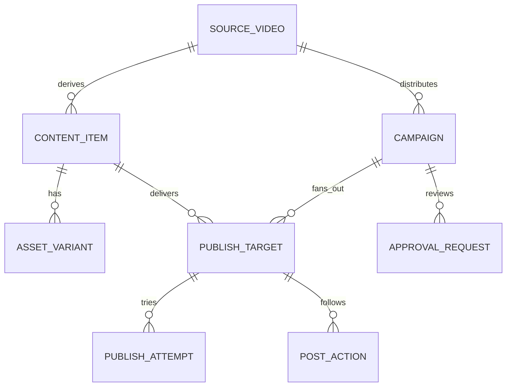

# Core data model

Priority: P1  
Depends on: foundation and rights

## What it is

Replace the overloaded `ScheduledPost` concept with durable sources, delivery
units, variants, campaigns, targets, attempts, post-actions, approvals, and
events in PostgreSQL.

## How it works

One `SourceVideo` owns `ContentItem` rows. `WHOLE_VIDEO` has no chunk index;
`CHUNK` does. A campaign creates a target for each selected account and valid
delivery unit. Attempts and post-actions are appendable children, not fields
overwritten on the target.

## Important information

- Additive migrations must preserve existing `ScheduledPost` rows.
- Platform-specific metadata is validated, versioned JSON on a target.
- Status transitions occur through domain functions, never arbitrary strings.
- Unique keys enforce one target per campaign revision, content item, and account.

## Done when

Prisma migrations apply to a copy of the current database, old rows remain
readable, and fixtures prove the 1 + N + N target formula without duplicates.

