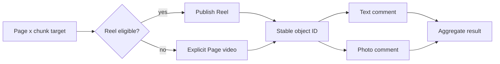

# Facebook chunk publishing

Priority: P2  
Depends on: media variants, social account vault, publisher queue

## What it is

Publish every vertical chunk independently to selected administered Facebook
Pages, then attach configured text/photo affiliate comments.

## How it works

Each Page x chunk is a target. The adapter chooses Reel or explicit Page-video
fallback from validated constraints, uploads and polls until a stable Facebook
object ID exists, then runs child comment actions. Child failure does not repeat
the video upload.

## Important information

- Page access tokens and Page-management permissions are required.
- Each comment action has its own idempotency key and attempt history.
- Store the approved Shopee link snapshot; do not look up a replacement at run
  time.
- `partial_success` is correct when video succeeds but a comment fails.

## Done when

All chunks publish once to one sandbox Page; configured comments attach to the
correct objects; retrying one failed comment never re-uploads its video.

