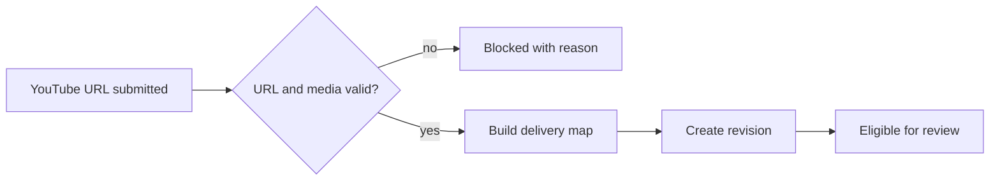

# Foundation contract

Priority: P0  
Depends on: nothing

## What it is

Freeze the rules every later feature relies on: URL-only source input,
delivery-unit mapping, platform/account selection, and immutable approval
revisions.

## How it works

The webhook receives one YouTube URL without additional rights metadata. A
campaign maps one source to one whole YouTube item and N Facebook/TikTok chunk
items per selected brand profile. Any material edit increments the revision and
invalidates approval.

## Important information

- The upload-unit mapping is a backend invariant, not merely a UI default.
- The YouTube whole output preserves original visuals but uses the edited
  Vietnamese voice, subtitles, brand watermark, and quiet signature music.
- One Telegram approval covers the selected campaign temporarily.

## Done when

One URL-only, one-brand fixture with three chunks deterministically maps to one
YouTube item, three Facebook items, and three TikTok items; variable chunk
counts use the same formula.
