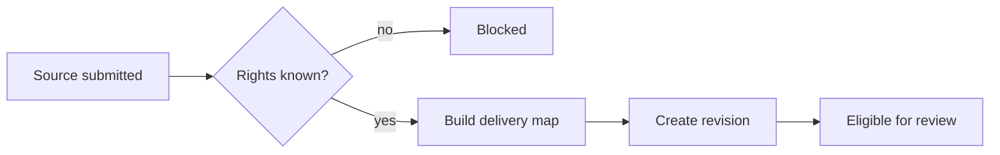

# Foundation and rights

Priority: P0  
Depends on: nothing

## What it is

Freeze the rules every later feature relies on: lawful source use, delivery-unit
mapping, platform/account selection, and immutable approval revisions.

## How it works

Every source carries `rights_status`. Only `owned`, `licensed`,
`public_domain`, or `permission` may enter review. A campaign maps one source to
one whole YouTube item and N Facebook/TikTok chunk items. Any material edit
increments the revision and invalidates approval.

## Important information

- Transforming or translating copied media does not establish copyright rights.
- The upload-unit mapping is a backend invariant, not merely a UI default.
- One Telegram approval covers the selected campaign temporarily.
- Unknown rights is a validation failure, not a warning.

## Done when

One written fixture with three chunks deterministically maps to one YouTube item,
three Facebook items, and three TikTok items; an unknown-rights fixture cannot
be approved.

