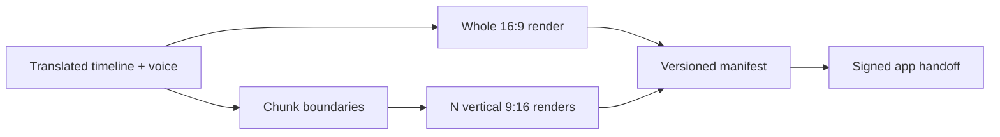

# Media variants and manifest

Priority: P2 prerequisite  
Depends on: foundation and rights

## What it is

Produce the exact asset topology required by the confirmed upload mapping: one
whole landscape video for YouTube and one vertical video per chunk for Facebook
and TikTok.

## How it works

The render service uses one source timeline but separate named layouts. It writes
a whole 1920x1080 file and N 1080x1920 chunk files, then generates a manifest
with checksums, codec, duration, dimensions, size, and render warnings.

## Important information

- YouTube never references a chunk; Facebook/TikTok never reference the whole.
- Keep normalized preset coordinates and per-layout safe zones.
- The manifest, not a guessed filename, is the delivery contract.
- Preserve current rendered assets while introducing new paths.

## Done when

A three-chunk fixture produces one valid 1920x1080 whole video, three valid
1080x1920 chunk videos, stable checksums, accurate probe metadata, and a schema-
valid manifest.

