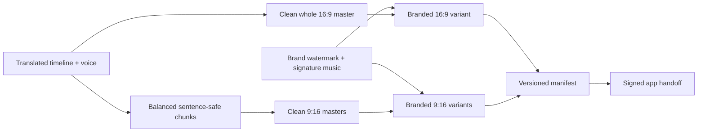

# Media variants and manifest

Priority: P2 prerequisite  
Depends on: foundation and rights

## What it is

Produce the exact asset topology required by the confirmed upload mapping:
reusable clean masters followed by one branded whole landscape video and one
branded vertical video per chunk for every selected brand profile.

## How it works

The render service uses one source timeline but separate named layouts. It
creates a clean 1920x1080 whole master and N clean 1080x1920 chunk masters.
Each brand profile then applies its watermark and signature music to both
ratios. The manifest records checksums, codec, duration, dimensions, size,
brand/revision identity, and render warnings.

## Important information

- YouTube never references a chunk; Facebook/TikTok never reference the whole.
- Sources from 5-9 minutes create one chunk. Longer sources create variable,
  balanced 4-5 minute chunks named `part_<1-based index>`.
- Boundaries may shift up to 15 seconds to the closest transcript-segment end;
  chunks remain ordered, unique, and non-overlapping.
- A same-brand Facebook and TikTok target may reuse its branded vertical file.
  Different brands require different branded variants.
- Keep normalized preset coordinates and per-layout safe zones.
- The manifest, not a guessed filename, is the delivery contract.
- Preserve current rendered assets while introducing new paths.

## Done when

A three-chunk, one-brand fixture produces valid clean masters, one branded
1920x1080 whole video, three branded 1080x1920 chunk videos, stable checksums,
accurate probe metadata, and a schema-valid manifest.
