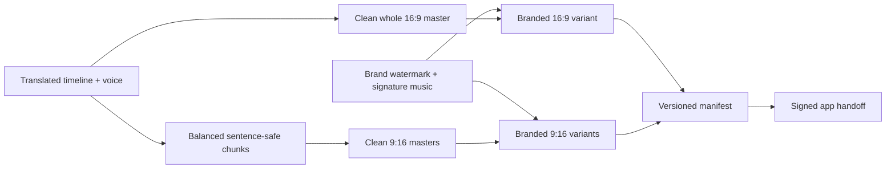
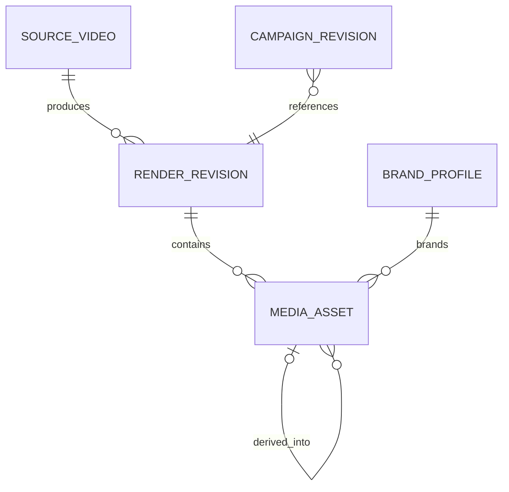
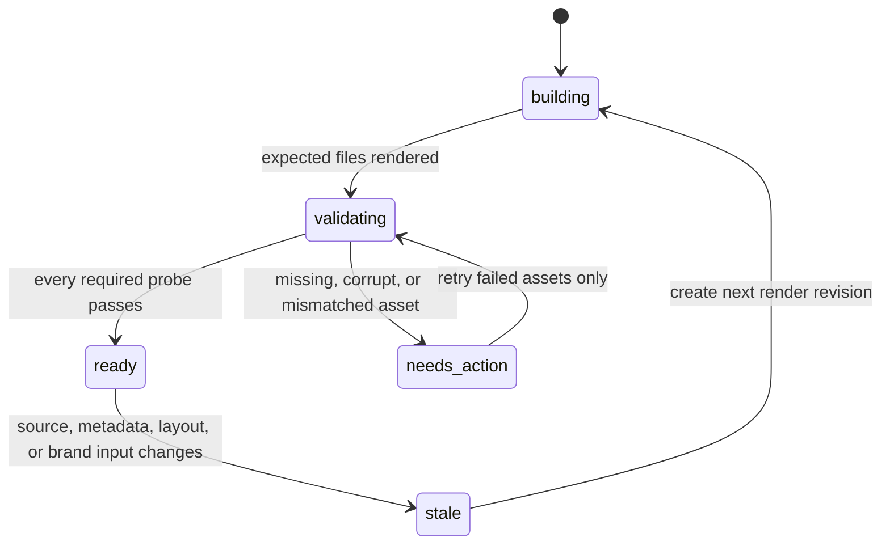
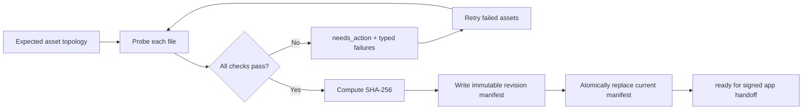

# Media variants and manifest

Priority: P2 prerequisite  
Depends on: foundation contract

## What it is

Produce the exact asset topology required by the confirmed upload mapping:
reusable clean masters followed by one branded whole landscape video and one
branded vertical video per chunk for every selected brand profile.

## How it works

The render service uses one source timeline but separate named layouts. It
creates a clean 1920x1080 whole master and N clean 1080x1920 chunk masters.
Each brand profile then applies its watermark and signature music to both
ratios. The manifest records checksums, codec, duration, dimensions, size,
brand/revision identity, and render warnings.



## Important information

- YouTube never references a chunk; Facebook/TikTok never reference the whole.
- Sources from 5-9 minutes create one chunk. Longer sources create variable,
  balanced 4-5 minute chunks named `part_<1-based index>`.
- Boundaries may shift up to 15 seconds to the closest transcript-segment end;
  chunks remain ordered, unique, and non-overlapping.
- A same-brand Facebook and TikTok target may reuse its branded vertical file.
  Different brands require different branded variants.
- Keep normalized preset coordinates and per-layout safe zones.
- The manifest, not a guessed filename, is the delivery contract.
- Preserve current rendered assets while introducing new paths.

## Revision and ownership boundary

The render service owns a monotonically increasing `render_revision`. It does
not create application campaigns. At handoff, the Next.js app creates a
campaign revision that references one immutable ready render revision. This
keeps media production resumable before the review application exists while
preserving the rule that an asset edit invalidates approval.



Clean assets have no `brand_id`. Branded assets require a `brand_id` and a
`lineage_asset_id` pointing to the clean master from which they were derived.
The app-owned campaign ID is deliberately absent until signed handoff.

## Stable paths

```text
data/<video_id>/
|-- outputs/
|   |-- clean/
|   |   `-- revision/<render_revision>/
|   |       |-- whole-16x9.mp4
|   |       `-- vertical/part_<n>-9x16.mp4
|   `-- brands/<brand_id>/revision/<render_revision>/
|       |-- whole-16x9.mp4
|       `-- vertical/part_<n>-9x16.mp4
|-- manifests/revision/<render_revision>.json
`-- media-manifest.json
```

`media-manifest.json` is the atomic current pointer. Historical revision files
and their revisioned asset paths are immutable evidence. All identifiers are
validated before joining paths; requests cannot escape the video's mounted
data directory.

## State and recovery



- A render revision becomes `ready` only when the expected topology is
  complete and every file has video and audio streams, expected dimensions and
  codecs, expected duration, byte size, and SHA-256 evidence.
- A partially valid revision remains `needs_action`; verified peer files are
  preserved and may be reused by a safe retry.
- Repeating validation for the same files is idempotent. The revision manifest
  is written through a temporary file and rename, so readers never see half a
  JSON document.
- A ready revision is immutable. Changed inputs create the next revision and
  mark the previous current manifest stale rather than overwriting its assets.

## Edge-case contract

| Case | Result | Recovery |
| --- | --- | --- |
| Required file is absent or empty | Revision cannot become ready | Render only the missing asset, then validate again |
| `ffprobe` cannot open a file or a stream is missing | Typed validation failure | Preserve peers and rerender that asset |
| Whole asset is not 1920x1080 | Reject the whole asset | Rerender with `yt-landscape` |
| Vertical asset is not 1080x1920 | Reject that chunk | Rerender its vertical layout |
| Duration differs from its source span | Reject that asset | Retry the responsible render stage |
| Duplicate asset identity or path | Reject the manifest | Fix topology; never guess which file wins |
| Unsafe video, brand, or part identifier | Reject before filesystem access | Correct the configuration |
| Brand asset points to another brand's path | Reject lineage/topology | Regenerate inside the selected brand path |
| Source or visual metadata changes | Previous revision becomes stale | Build a new revision and request approval again later |

## Completion flow



## Done when

A three-chunk, one-brand fixture produces valid clean masters, one branded
1920x1080 whole video, three branded 1080x1920 chunk videos, stable checksums,
accurate probe metadata, and a schema-valid manifest.
