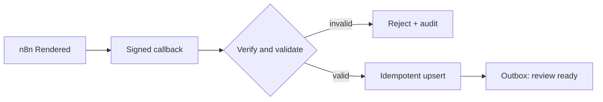

# n8n-to-app handoff

Priority: P1  
Depends on: core data model, media manifest

## What it is

A signed and idempotent boundary that turns completed n8n renders into review
items in the scheduler app.

## How it works

n8n sends identifiers, manifest data, warnings, revision, timestamp, and an HMAC.
The app verifies freshness/signature, validates all paths/checksums, upserts the
source and assets by deterministic key, and writes an outbox event in the same
transaction.

## Important information

- No media bytes enter n8n or the callback.
- Repeated delivery must return success without duplicating assets/campaigns.
- Canonicalize paths and restrict them to the mounted media root.
- A database commit and its outbox event are one transaction.

## Done when

Sending the same valid callback repeatedly creates one source/revision and one
review-ready event; tampered, expired, or path-traversal payloads are rejected.

