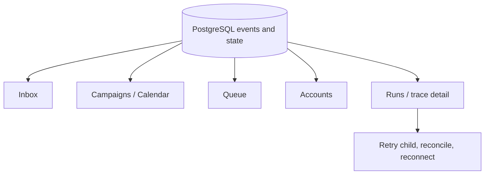

# Operations dashboard

Priority: P5  
Depends on: at least one working provider adapter

## What it is

The visual operating surface for accounts, campaigns, queue state, platform
results, partial failures, and manual recovery across 5-10 accounts per platform.

## How it works

Read models aggregate normalized source/campaign/target/attempt/action events.
Inbox owns approval; Accounts owns credentials; Queue/Calendar owns scheduling;
Runs owns detailed traces and safe retry/reconcile actions.

## Important information

- Prefer a few purpose-built views over a generic dashboard full of counts.
- All actions call state-transition commands; the UI never patches status.
- Show target counts before approval and partial success after publishing.
- Account health includes scopes, expiry, last success/failure, and reconnect.

## Done when

An operator can find any source, target, attempt, external ID, or failed child
action; understand its current state; and take only context-safe recovery actions
without opening n8n or the database.

