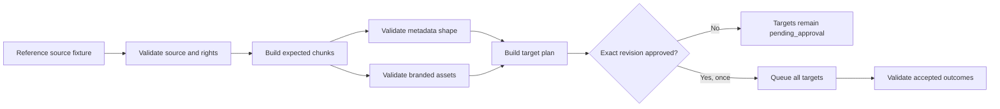
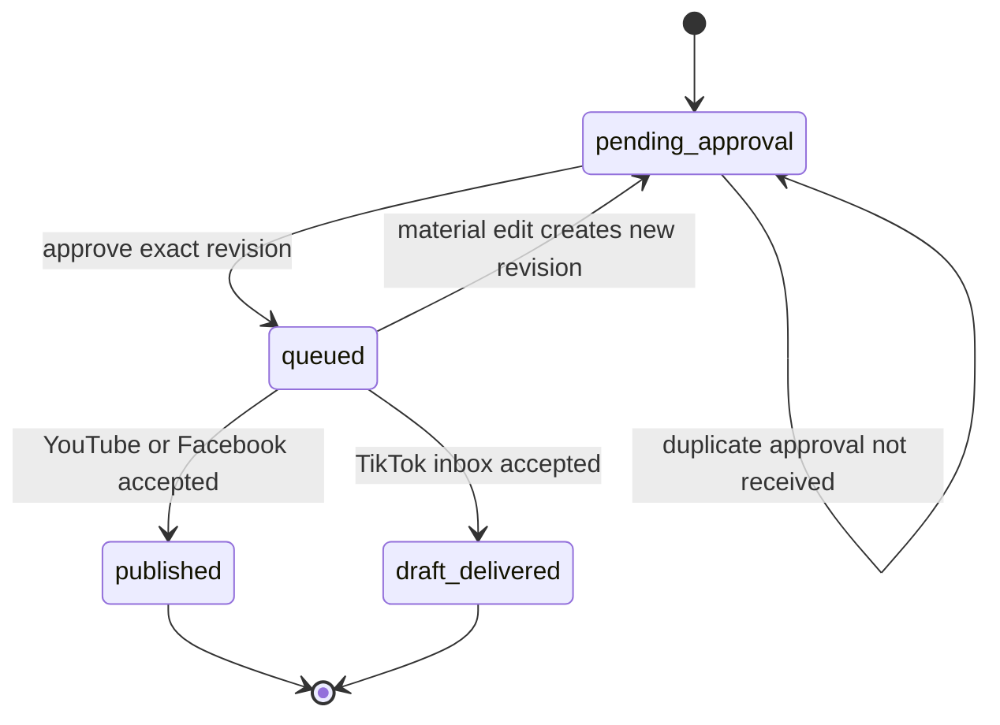
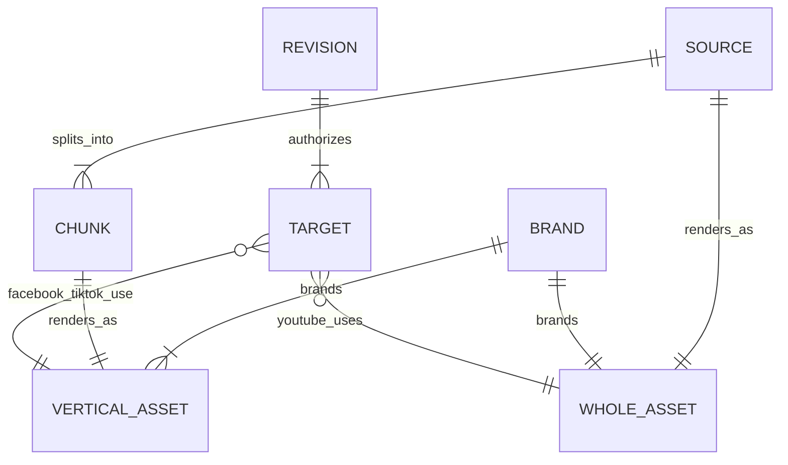

# Pipeline acceptance contract

Status: verified  
Priority: P0  
Depends on: confirmed product decisions  
Consumed by: source validation, chunking, metadata, rendering, review, approval,
and publishing

## Outcome and boundary

Provide one executable, provider-free contract that later implementation stages
must satisfy. It describes correct behavior without downloading media, calling
OpenAI, changing n8n, or uploading to social platforms.

The contract owns expected behavior, not production state. Production services
remain responsible for persistence, retries, rendering, and provider calls.

## Reference flow

## Frozen reference fixtures

| Source duration | Expected chunks | Expected balanced durations |
|---|---:|---|
| 5:00 | 1 | 5:00 |
| 9:00 | 1 | 9:00 |
| 10:00 | 2 | 5:00, 5:00 |
| 13:42 | 3 | 4:34, 4:34, 4:34 |
| 20:00 | 4 | 5:00 each |

Five through nine minutes is deliberately one chunk. For longer videos,
4-5 minutes is the desired duration rather than a rule that creates a tiny
remainder. Chunks are balanced; an implementation may shift a boundary by at
most 15 seconds to a transcript-segment end.

## State contract

- A replay of the same approval is a no-op.
- A stale revision cannot be approved.
- Metadata, brand, visual, or target edits create a new revision and invalidate
  the old approval.
- Post-text and target edits do not require a media rerender. Visual-text or
  brand edits mark affected media stale.

## Relationship contract

For one brand containing one account per platform and three chunks, the target
plan is exactly seven: one YouTube whole-video target, three Facebook chunk
targets, and three TikTok chunk-draft targets. Facebook and TikTok reuse the
same vertical asset only when it belongs to the same brand.

## Edge-case and recovery contract

| Case | Required behavior | Recovery |
|---|---|---|
| Duration below 5:00 or above 20:00 | block before processing | replace source |
| Corrupt, below 720p, or unknown rights | block review and approval | correct source/rights and resume |
| Zero chunks or missing asset | block review | retry the failed production stage |
| Wrong asset ratio/platform mapping | reject target plan | rebuild the plan |
| Approval replay | do not duplicate targets or audit action | none required |
| Edit after approval | create revision and invalidate approval | rerender only when needed, then approve again |
| TikTok draft delivered | never label publicly published | finish manually in TikTok |

## Current implementation gap

The existing chunker uses a four-minute ceiling and produces chunk counts
`2, 3, 3, 4, 5` for the five reference durations. The accepted contract is
`1, 1, 2, 3, 4`. This is expected to remain red against production until the
Step 2 chunker work is implemented.

## Done when

The reference fixture suite passes without network access and detects invalid
sources, invalid metadata shape, missing assets, incorrect target mapping,
pre-approval execution, approval replay, stale approval, edit invalidation, and
incorrect TikTok completion semantics.
