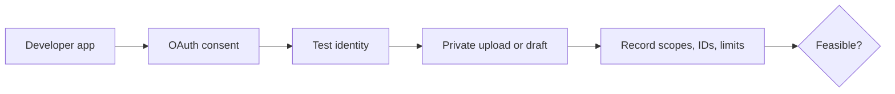

# Platform sandbox

Priority: P0  
Depends on: foundation and rights

## What it is

A short feasibility exercise using one real test identity on each platform
before building full adapters and interfaces.

## How it works

Create developer applications, request minimum scopes, connect one YouTube
channel, one administered Facebook Page, and one TikTok account, then perform
private/draft test operations and record actual IDs, limits, and errors.

## Important information

- Use test/private visibility; do not publish production content in this task.
- Facebook scope is Page publishing, not personal-profile automation.
- TikTok MVP requires `video.upload`, not Direct Post's `video.publish`.
- Shopee access is a separate credential check and may remain blocked.

## Done when

The repository contains a redacted evidence note listing approved scopes,
callback URLs, account identifiers, test result, and any review blockers for all
three platforms.

