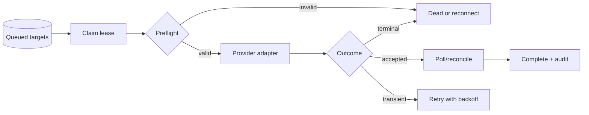

# Publisher queue and worker

Priority: P1  
Depends on: core data model, social account vault

## What it is

A durable background process that owns scheduling, claiming, uploading, polling,
retrying, and reconciling publish targets outside HTTP page requests.

## How it works

The worker claims eligible PostgreSQL rows with `FOR UPDATE SKIP LOCKED`, sets a
lease, validates the target, dispatches to a provider adapter, records each
attempt, and renews or releases the lease. An outbox dispatcher handles wakeups
and notifications.

## Important information

- Remove all publishing side effects from `GET /api/posts`.
- Execution is at-least-once; intent must be idempotent.
- A timeout after provider acceptance is an unknown outcome requiring
  reconciliation, not a blind retry.
- Apply concurrency/rate limits by provider and account.

## Done when

Restarting the web app or worker during queued, uploading, and polling states
does not lose work or duplicate a confirmed external upload.

