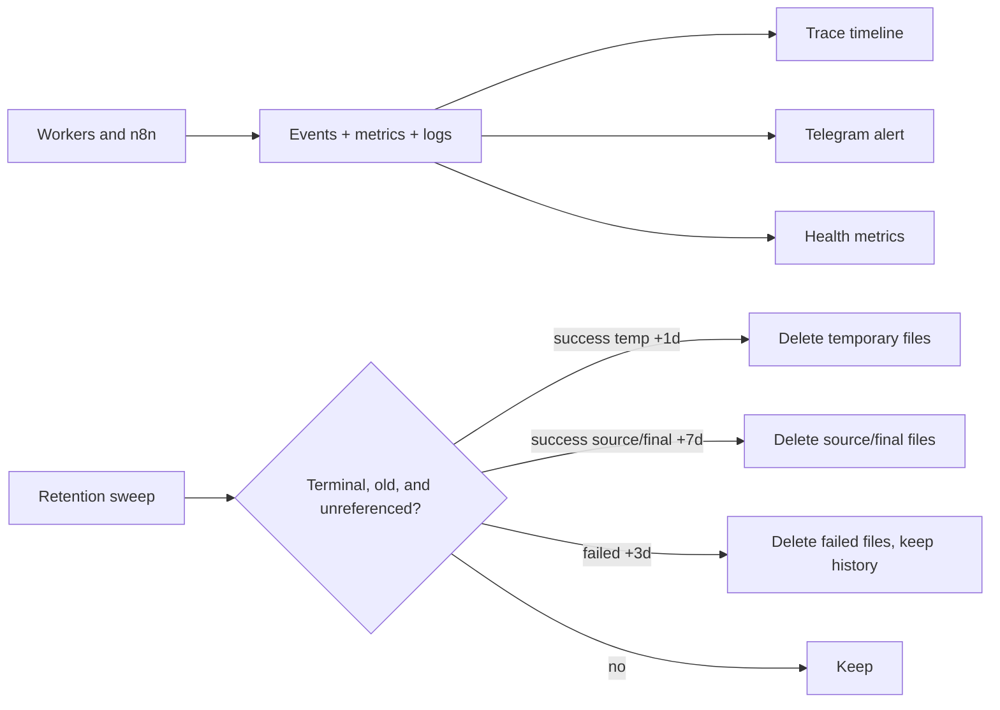

# Reliability, observability, and retention

Priority: P5  
Depends on: publisher queue and all enabled adapters

## What it is

The operational hardening that makes failures diagnosable, retries safe, files
reclaimable, and backups restorable.

## How it works

Every campaign receives a trace ID and append-only attempts/audit events.
Transient failures retry by policy; exhausted processing failures become
`needs_action`; post-approval target failures become `partial_failure`.
Retention deletes files only after age and reference checks while keeping source,
campaign, metadata, and audit history available for intentional reprocessing.

## Important information

- Never delete an asset referenced by queued, leased, retrying, or unknown targets.
- A failed campaign is a recoverable execution state, not a permanent URL ban.
- Telegram alerts when user action is required and sends a final summary; every
  lower-level failure remains visible in the audit timeline.
- Redact tokens, signed URLs, approval IDs, and personal data from telemetry.
- Backup without the encryption key is not credential recovery; store key
  recovery separately and securely.
- Failure drills are acceptance tests, not optional cleanup.

## Done when

The documented failure matrix passes; a campaign is traceable end to end; alerts
name the exact target/action; retention preserves live references; and a restore
drill recovers application state and decryptable credentials.
