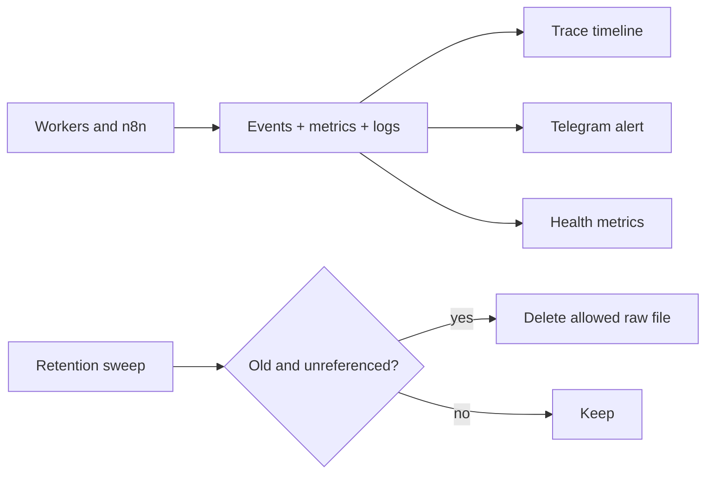

# Reliability, observability, and retention

Priority: P5  
Depends on: publisher queue and all enabled adapters

## What it is

The operational hardening that makes failures diagnosable, retries safe, files
reclaimable, and backups restorable.

## How it works

Every campaign receives a trace ID and append-only audit events. Metrics expose
queue age, provider latency, retries, dead jobs, and credential health. Retention
deletes raw inputs only after age and reference checks. Backups cover PostgreSQL,
n8n data, media manifests, and encryption-key recovery.

## Important information

- Never delete an asset referenced by queued, leased, retrying, or unknown targets.
- Redact tokens, signed URLs, approval IDs, and personal data from telemetry.
- Backup without the encryption key is not credential recovery; store key
  recovery separately and securely.
- Failure drills are acceptance tests, not optional cleanup.

## Done when

The documented failure matrix passes; a campaign is traceable end to end; alerts
name the exact target/action; retention preserves live references; and a restore
drill recovers application state and decryptable credentials.

