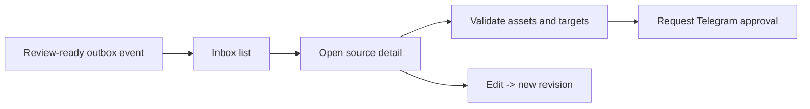

# Review inbox

Priority: P1  
Depends on: core data model, n8n-to-app handoff, social account vault

## What it is

The operator's visual queue for rendered sources awaiting one campaign-level
decision.

## How it works

The Inbox reads review projections from PostgreSQL. A detail view shows the
whole YouTube preview, all vertical chunks, warnings, platform metadata, selected
accounts, affiliate/comment preview, target count, schedule, and revision.

## Important information

- Show the exact fan-out count before approval.
- A TikTok target is labeled `draft`, never `published`.
- Warnings and failed preflights are visible without opening n8n.
- Media preview routes must be authenticated and path-safe.

## Done when

A three-chunk source shows one whole preview, three vertical previews, the exact
target formula/result, and cannot request approval until all required assets and
accounts pass preflight.

