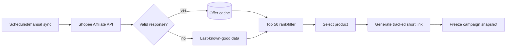

# Shopee affiliate catalog

Priority: P3  
Depends on: core data model; Facebook integration only for final comment use

## What it is

A Products page that caches and ranks up to 50 useful Shopee Affiliate offers,
then snapshots a chosen product and tracking link into a campaign revision.

## How it works

A scheduled sync calls the official Affiliate GraphQL API when credentials are
available, validates and upserts offers, and retains last-known-good data on
transient failure. Selection generates a short link with campaign/account
sub-IDs and freezes product/link fields on the campaign.

## Important information

- Official Open API requires Affiliate `app_id` and `secret_key`; this task may
  remain blocked until they are confirmed.
- Rank by expected value and quality, not commission rate alone.
- Display commission, sales, rating, price, discount, budget, seller type,
  expiry, and freshness.
- Third-party data or manual import is a labeled temporary mode, never silently
  mixed with official data.

## Done when

The page shows a fresh or explicitly stale Top 50, explains sorting, creates one
traceable short link, and preserves the exact approved product/link even after
the catalog refreshes.

