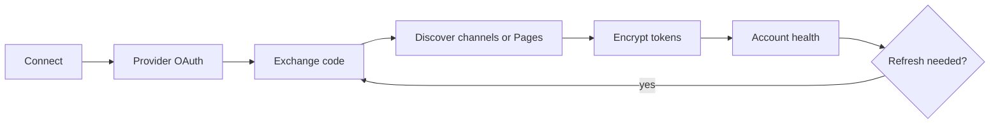

# Social account vault

Priority: P1  
Depends on: core data model, platform sandbox

## What it is

A first-class model for 5-10 YouTube channels, Facebook Pages, and TikTok
creators, separate from NextAuth login accounts and grouped through explicit
brand profiles.

## How it works

OAuth callbacks discover provider identities and store one encrypted credential
envelope per social account. The server refreshes tokens, records granted
scopes/expiry, and exposes only labels and health to clients.

## Important information

- Do not reuse NextAuth's `Account` table as the social-account registry.
- Encrypt tokens with authenticated encryption; redact all logs.
- Store provider user/channel/Page IDs, scopes, expiry, and reconnect reason.
- Brand membership supplies campaign selection, watermark, and signature music;
  credentials remain owned by the social account vault.
- A platform failure on one account must not disable peer accounts.

## Done when

Two accounts of one provider can be connected, labeled, independently refreshed,
selected, revoked, and shown as healthy or reconnect-required without exposing
tokens.
