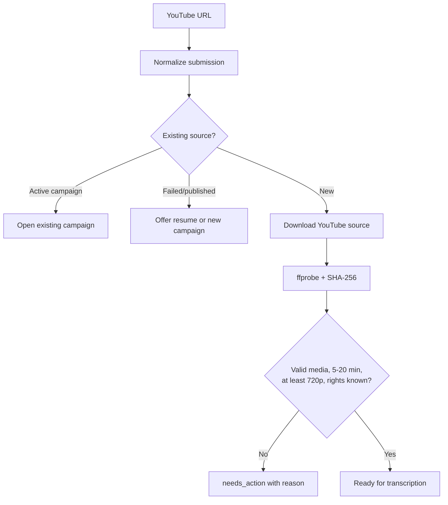
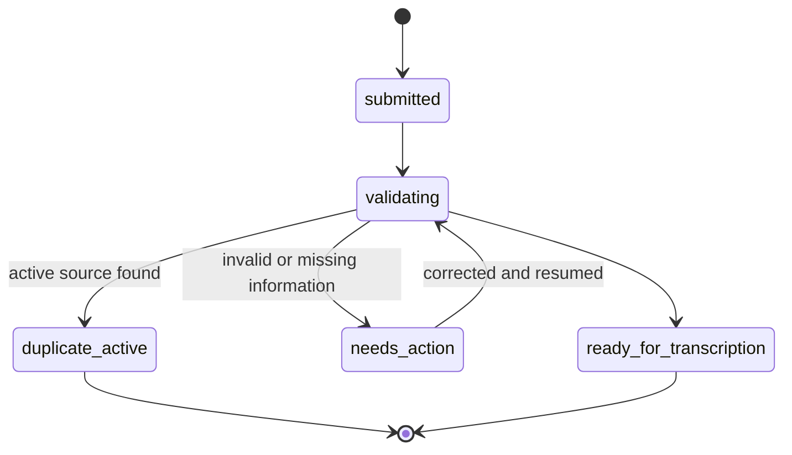
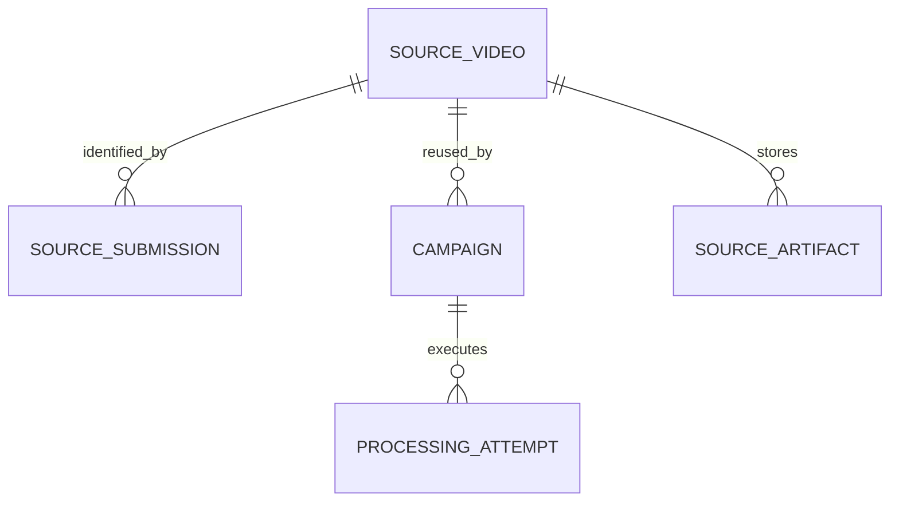

# Source ingest and validation

Status: proposed
Priority: P0
Depends on: foundation and rights
Consumed by: transcription, chunking, campaign review

## Outcome

Accept a YouTube URL exactly once, establish a stable source identity, and stop
invalid media before expensive transcription or rendering. Local-file import is
deferred until URL ingestion is reliable.

## Processing flow

## State lifecycle

## Data relationships

`SOURCE_VIDEO` holds normalized YouTube ID and downloaded content hash. A
submission records the URL used. A failed `PROCESSING_ATTEMPT` never makes the
source permanently unusable.

## Edge cases and recovery

| Case | Behavior | User recovery |
|---|---|---|
| URL belongs to running work | Do not duplicate it | Open the existing campaign |
| Previous campaign failed | Keep history and reusable artifacts | Retry failed stage or restart as new campaign |
| Previous campaign published | Warn about intentional duplicate publishing | Explicitly create a new campaign |
| URL changes but bytes match | Detect downloaded SHA-256 match | Choose existing source or intentional new campaign |
| Source was deleted remotely | Preserve history and mark download failure | Replace URL or stop |
| Corrupt, out-of-range, low-resolution, or unknown-rights input | Stop before transcription | Correct the input/rights and resume validation |

## Done when

Fixtures prove YouTube URL identity, validation boundaries, duplicate-active
protection, failed-stage resume, and intentional reprocessing without
permanently blacklisting a URL.
