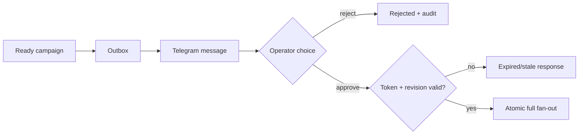

# Telegram campaign approval

Priority: P1  
Depends on: review inbox, publisher queue and worker schema

## What it is

One mobile approval that atomically authorizes the complete campaign fan-out for
the exact reviewed revision.

## How it works

An outbox dispatcher sends a summary with Approve, Reject, and Open buttons. The
button contains only an opaque, short-lived ID. The callback verifies the chat,
operator, expiry, one-use state, preflight, and revision before creating
all publish targets in one transaction.

## Important information

- One approval covers all selected platforms/accounts for the MVP.
- Any edit after message creation makes the button stale.
- Repeated button taps must return the existing decision, not create targets.
- Answer the Telegram callback quickly, then edit the message with the result.

## Done when

One approval creates the exact expected targets once; duplicate, expired,
wrong-chat, and stale-revision callbacks create none and produce audit events.
