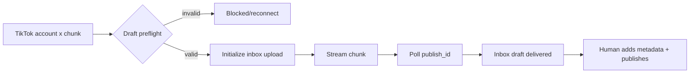

# TikTok chunk drafts

Priority: P4  
Depends on: media variants, social account vault, publisher queue

## What it is

Export every selected 9:16 chunk to the chosen TikTok account's inbox as a
draft; the operator completes caption, hashtags, cover, and publication in the
TikTok app.

## How it works

Each account x chunk is a target using the `video.upload` scope. The adapter
initializes `/v2/post/publish/inbox/video/init/`, streams the file to the returned
one-hour upload URL, stores `publish_id`, and polls until the inbox notification
is delivered or the user finishes publication.

## Important information

- Draft delivery is not public publication; reflect this in states and UI.
- The video draft API does not prefill final caption, hashtags, or cover. Keep
  prepared text beside the draft and send it through Telegram for copy/paste.
- Current official limits include a ten-minute video maximum and at most five
  pending shares per account in 24 hours; re-check official docs when coding.
- Three chunks consume three pending-share slots on each selected account.

## Done when

All eligible chunks reach one sandbox account's inbox exactly once, prepared
metadata is easily copyable, and the dashboard distinguishes draft delivered,
manually published, failed, and reconnect-required.

