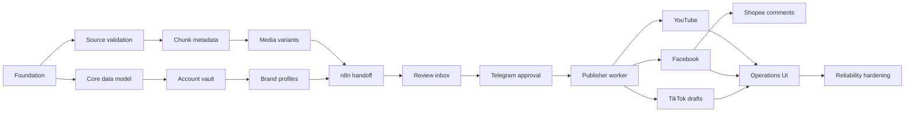

# Automated re-up platform — master todo

Source design: [automated-reup-platform-system-design.md](../reports/automated-reup-platform-system-design.md)

Execution roadmap: [pipeline-delivery-roadmap.md](pipeline-delivery-roadmap.md)

Follow the execution roadmap for milestone order, acceptance gates, and
evidence. The sections below remain the implementation inventory.

Status legend: `[ ]` not started, `[-]` in progress, `[x]` complete, `[!]` blocked.

## Confirmed product decisions

- [x] YouTube receives one whole 16:9 video per source.
- [x] Facebook Pages receive one 9:16 post per chunk.
- [x] TikTok receives one 9:16 draft per chunk for the MVP.
- [x] One Telegram approval authorizes the whole selected campaign fan-out.
- [x] Facebook destinations are administered Pages.
- [x] Accept YouTube URLs for the MVP; require readable 5-20 minute,
  at-least-720p media with known rights.
- [x] Defer local-file upload/import until URL ingestion is reliable.
- [x] Produce variable, unique, sentence-safe 4-5 minute chunks named
  `part_1`, `part_2`, and so on.
- [x] Generate whole-video YouTube metadata and per-chunk visual,
  Facebook, and TikTok metadata.
- [x] Default metadata to Vietnamese with curiosity-driven, engaging,
  never-misleading copy, at most two relevant emojis, and cost-first model
  selection.
- [x] Group YouTube, Facebook, and TikTok accounts in brand profiles that own
  the watermark and signature music for both ratios.
- [x] Allow failed-stage resume and intentional reprocessing without
  permanently blacklisting the source URL.
- [ ] Confirm Shopee Affiliate Open API `app_id` and `secret_key` availability.
- [ ] Record the fixture-selected OpenAI model and cost ceiling, and calibrate
  exact signature-music ducking behavior.

## P0 — prove assumptions and contracts

- [ ] [Pipeline delivery roadmap - complete Steps 0-3](pipeline-delivery-roadmap.md)
- [ ] [Foundation and rights](foundation_and_rights/todo.md)
- [ ] [Source ingest and validation](source_ingest_validation/todo.md)
- [ ] [Chunk and whole-video metadata generation](chunk_metadata_generation/todo.md)
- [ ] [Brand profiles and branded variants](brand_profiles/todo.md)
- [ ] [Media variants and manifest](media_variants_manifest/todo.md)
- [ ] [Platform sandbox](platform_sandbox/todo.md)

## P1 — first reliable YouTube vertical slice

- [ ] [Core data model](core_data_model/todo.md)
- [ ] [Social account vault](social_account_vault/todo.md)
- [ ] [n8n-to-app handoff](n8n_app_handoff/todo.md)
- [ ] [Review inbox](review_inbox/todo.md)
- [ ] [Telegram campaign approval](telegram_campaign_approval/todo.md)
- [ ] [Publisher queue and worker](publisher_queue_worker/todo.md)
- [ ] [YouTube whole-video publishing](youtube_whole_video/todo.md)

## P2 — correct assets and Facebook chunks

- [ ] [Facebook chunk publishing](facebook_chunk_publishing/todo.md)

## P3 — commerce data

- [ ] [Shopee affiliate catalog](shopee_affiliate_catalog/todo.md)

## P4 — TikTok draft MVP

- [ ] [TikTok chunk drafts](tiktok_chunk_drafts/todo.md)

## P5 — scale and operate

- [ ] [Operations dashboard](operations_dashboard/todo.md)
- [ ] [Reliability, observability, and retention](reliability_observability_retention/todo.md)

## Dependency path

## Pipeline-correctness milestone

Before connecting real publishers, one accepted source must create a valid
whole 16:9 asset, every required 9:16 chunk, selected metadata, mock-branded
variants, and a complete manifest. A failed stage must be resumable without
repeating successful work.
