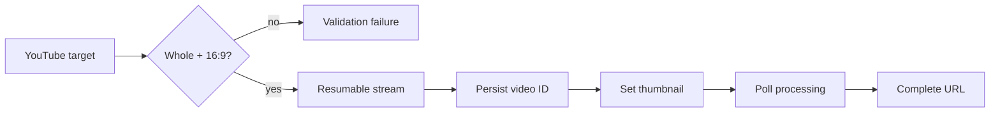

# YouTube whole-video publishing

Priority: P1  
Depends on: media manifest, social account vault, publisher queue

## What it is

The first production adapter: publish exactly one whole 16:9 source video to
each selected YouTube channel, then set its custom thumbnail.

## How it works

The adapter verifies a `WHOLE_VIDEO`/16:9 target and approved metadata revision,
refreshes the selected channel credential, streams a resumable upload, persists
its upload/video IDs, sets the generated custom thumbnail, polls processing, and
records the final URL.

## Important information

- Never read the entire video into process memory.
- The selected `SocialAccount` determines the channel; do not use the first
  Google/NextAuth account.
- Preserve provider upload/session IDs for recovery after timeouts.
- An unverified Google API project may force uploads to private visibility.

## Done when

A private sandbox upload sends the whole landscape file—not any chunk—sets the
thumbnail, records the URL/attempts, and survives a worker restart without a
duplicate video.
