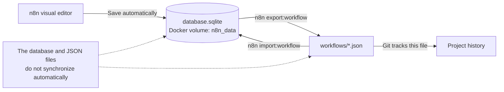
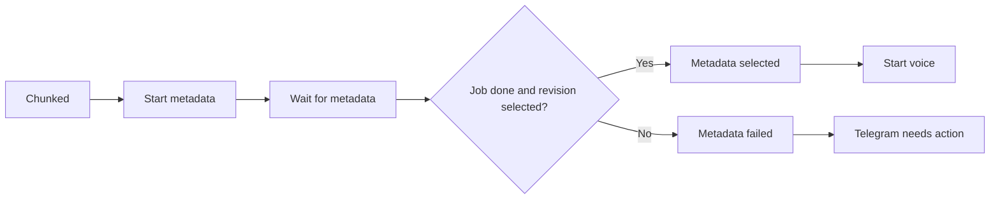
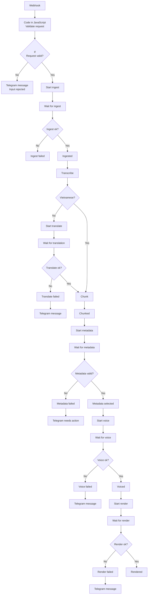
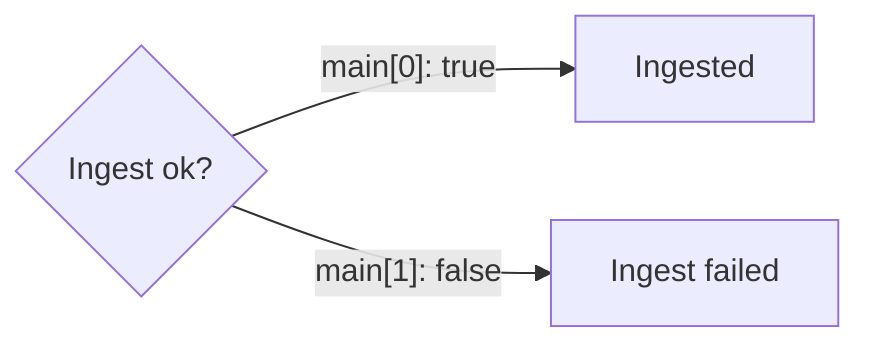

# How n8n workflows are stored and connected

## Where the workflow lives



This project has two workflow locations:

- Live runtime: `/home/node/.n8n/database.sqlite` inside the n8n container.
- Exported files: `automation/workflows/*.json`.

The live database is stored in the external Docker volume named `n8n_data`.
Recreating the n8n container does not remove that volume.

The workflow folder is mounted read-only at `/workflows` inside the container.
The JSON files are backups and deployment artifacts. n8n does not load or
synchronize them automatically. A file only enters the database when it is
explicitly imported.

## Current canonical workflow

The live database workflow was exported and round-trip verified on September 9,
2026. On September 10, the canonical JSON was extended with the reviewed
metadata gate and media-revision render handoff. On September 11, it was
imported in place into the existing live workflow, re-exported, and checked
against the same eleven structural contract tests. On September 15, it was
exported again to `artifacts/n8n-backups/reup-pipeline-live-2026-09-15.json`.
The live and canonical workflows were then extended with a manual test route
and a render-ready Telegram summary. They now have the same 39 nodes and the
same metadata/render/manual-test configuration. The workflow remains inactive
and keeps its original identity and credential references.

The Cloudflare Tunnel endpoint `https://rexsantech.com/webhook/reup-pipeline`
was also verified on September 15. A deliberately invalid request exercised
the configured Telegram input-rejection notification and completed as n8n
execution 87. The workflow was unpublished and restarted inactive immediately
after the test; no media was downloaded and no social-platform post was made.

| Version | Nodes | Last update |
| --- | ---: | --- |
| Live database `video editing` (`reupPipeline`) | 39 | September 15, 2026 manual-test import/export |
| Canonical `reup-pipeline.json` | 39 | Matches live runtime behavior on September 15, 2026 |
| `f7-render.json` | 24 | September 7, 2026 |
| Live-to-canonical difference | Only n8n `versionId`/`versionCounter` metadata | No import required |

The corrected source `chatId` and Vietnamese invalid-input guidance are now in
both the canonical file and live workflow. Do not overwrite them with an older
phase snapshot or pre-import export.

The six canonical metadata nodes are:

- `Start metadata`
- `Wait for metadata`
- `Metadata valid?`
- `Metadata selected`
- `Metadata failed`
- `Metadata needs action`

Do not import `f7-render.json` or a pre-import backup over the current workflow.
They are older snapshots. Use `reup-pipeline.json` as the canonical source.

All workflows were inactive at the time of inspection. An inactive workflow
can be edited and tested manually, but its production webhook is not active.

The manual test route is `Manual Trigger -> Manual test URL (edit here) ->
Start ingest`. It bypasses the Telegram-update parser, lets an operator set
`videoUrl` in the editor, and sends the `Pipeline ready notification` only
after a `ready` manifest with zero failures.

## Prepared canonical flow



The canonical JSON passed eleven structural contract tests before and after its
in-place live import. Pre/post-import exports are stored in
`artifacts/n8n-backups/`; the external `n8n_data` volume was preserved.

After voice generation, the canonical `Start render` node calls
`/media-revision/jobs`. Its success gate requires a completed job, a `ready`
manifest, and zero asset failures; the output is the manifest path rather than
the legacy ambiguous `processed_path`.

## Current live workflow



## How a node is defined

A workflow JSON file has two important sections:

```json
{
  "nodes": [],
  "connections": {}
}
```

An actual Webhook node from this pipeline looks like this:

```json
{
  "id": "a1000000-0000-4000-8000-000000000001",
  "name": "Webhook",
  "type": "n8n-nodes-base.webhook",
  "typeVersion": 2.1,
  "position": [-200, 0],
  "parameters": {
    "httpMethod": "POST",
    "path": "reup-pipeline"
  }
}
```

The fields mean:

- `id`: stable internal identity for the node.
- `name`: visible name and the name used by connections.
- `type`: implementation that n8n runs.
- `typeVersion`: version of that node implementation.
- `position`: location of the node in the visual editor.
- `parameters`: configuration that controls what the node does.

## How nodes connect

This connection sends the Webhook output to the Start ingest input:

```json
{
  "Webhook": {
    "main": [
      [
        {
          "node": "Start ingest",
          "type": "main",
          "index": 0
        }
      ]
    ]
  }
}
```

Read it as:

```text
Webhook output 0 -> Start ingest input 0
```

For an `If` node:

```text
main[0] = true output
main[1] = false output
```

For example:

```json
{
  "Ingest ok?": {
    "main": [
      [{ "node": "Ingested", "type": "main", "index": 0 }],
      [{ "node": "Ingest failed", "type": "main", "index": 0 }]
    ]
  }
}
```



During execution, nodes normally pass arrays of JSON items to the next node.
Expressions such as `$json` read the current item. Expressions such as
`$node["Node name"]` read data from another node in the same execution.

## Export the latest database workflow

Run these commands from `automation/`:

```powershell
docker compose exec -T n8n n8n export:workflow `
  --id=reupPipeline `
  --pretty `
  --output=/tmp/reup-pipeline.json

docker cp n8n:/tmp/reup-pipeline.json `
  .\workflows\reup-pipeline.json
```

This creates the following host file:

```text
automation/workflows/reup-pipeline.json
```

The `/workflows` mount is read-only inside the container. The command therefore
exports to `/tmp` first and then copies the result to the host folder.

## Import a workflow file into the database

Run this from `automation/`:

```powershell
docker compose exec -T n8n n8n import:workflow `
  --input=/workflows/reup-pipeline.json
```

Importing changes the database. Check the file first so an old export does not
replace a newer live workflow.

## Recommended workflow lifecycle

Use one canonical file named `automation/workflows/reup-pipeline.json`:

```text
Edit in n8n
    -> save to the live database
    -> test the workflow
    -> export reupPipeline
    -> review reup-pipeline.json
    -> commit the JSON file
```

This makes the responsibilities clear:

- The database is the live editing and execution source.
- `reup-pipeline.json` is the version-controlled deployment source.
- Phase files such as `f5`, `f6`, and `f7` are historical snapshots.
