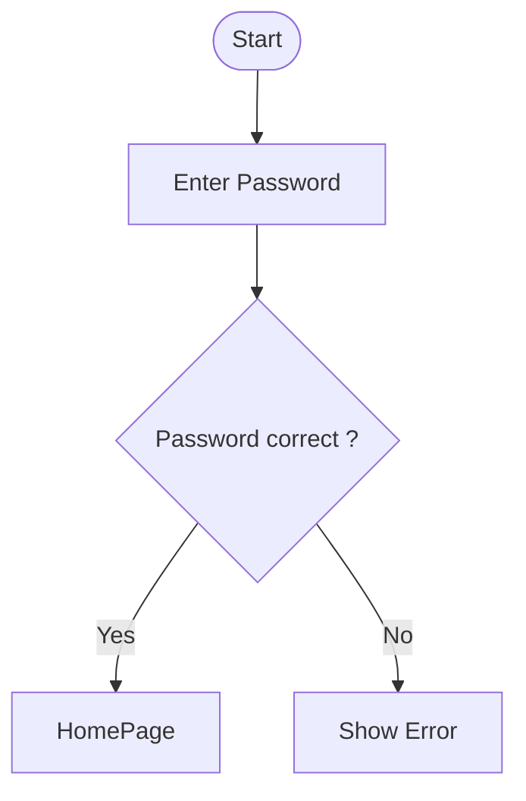
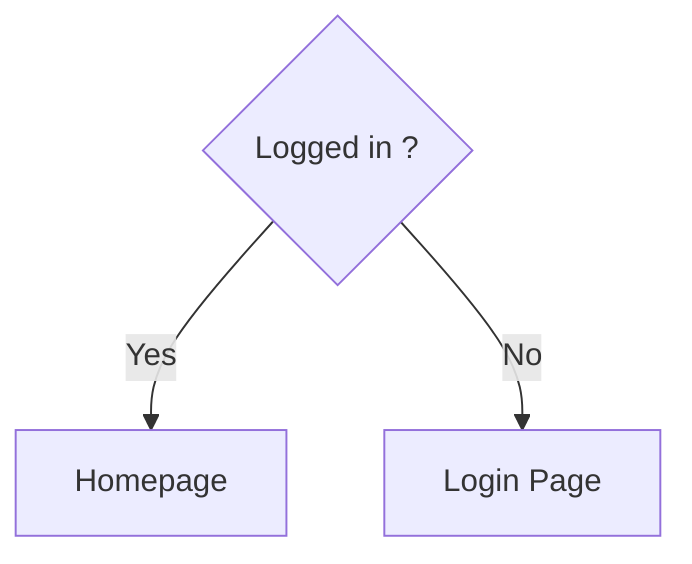
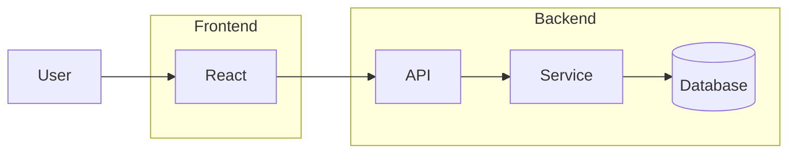
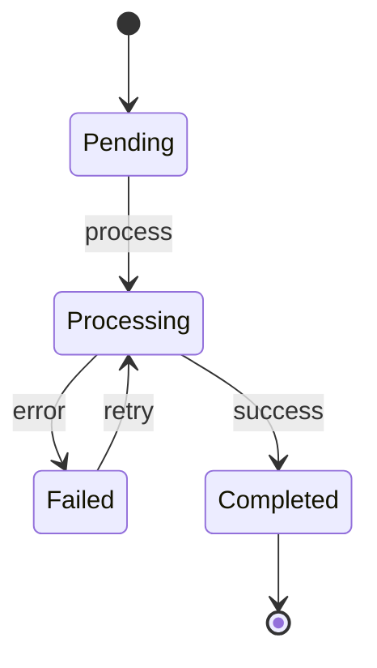
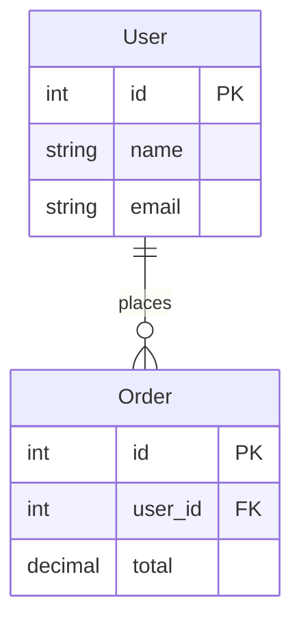

# flowchart

A[Rectangle]

B(Rounded)

C{Decision}

D[(Database)]

E((Circle))

[ ]       Process
{ }       Decision
[( )]     Database
([ ])     Start / End

# Subgraph

# state diagram 

# ERD 

