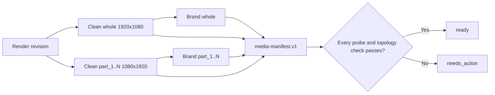

# Media manifest contract - Step 2

Status: contract, clean masters, mock-brand variants, and production job path verified
Verified: 2026-09-10

## Result

The render service now has a versioned `media-manifest.v1` contract. It defines
the exact clean and branded asset identities that later publishing code may
consume; ambiguous legacy names such as `final.mp4` are not part of this new
delivery contract.



## Implemented contract

- Revisioned clean and branded paths, so an older manifest never points at a
  file silently overwritten by a newer render.
- Deterministic 32-character asset IDs that remain stable across a safe retry
  and change for a new render revision.
- H.264 video and AAC audio requirements.
- Exact 1920x1080 whole and 1080x1920 vertical dimensions.
- Required audio and video streams, duration tolerance, file size, and SHA-256.
- Complete ready-state topology for one whole asset, every `part_<n>`, and
  every selected brand.
- Clean-master lineage for every branded asset.
- Identifier/path validation that prevents brand or content IDs from escaping
  the mounted video directory.
- Immutable historical revision manifests and an atomically replaced
  `media-manifest.json` current pointer.
- A `yt-landscape` preset and direct whole-source renderer that replaces source
  audio with the Vietnamese voice and burns whole-timeline subtitles.

## Storage shape

```text
data/<video_id>/
|-- outputs/clean/revision/<n>/
|   |-- whole-16x9.mp4
|   `-- vertical/part_<n>-9x16.mp4
|-- outputs/brands/<brand_id>/revision/<n>/
|   |-- whole-16x9.mp4
|   `-- vertical/part_<n>-9x16.mp4
|-- manifests/revision/<n>.json
`-- media-manifest.json
```

## Ownership decision

The Docker render service owns `render_revision`. The Next.js app later owns
`campaign_revision` and references one ready render revision during signed
handoff. This prevents n8n from becoming the campaign system of record.

## Failure and retry behavior

An absent, empty, corrupt, streamless, wrong-size, wrong-codec, or
wrong-duration file cannot enter a ready manifest. A partial revision remains
`needs_action`; valid peer assets stay on disk and retry can rebuild only the
failed asset. Rewriting an existing revision with different content is rejected
as an immutable-revision conflict.

## Evidence

- `40 passed` across the manifest, direct landscape, concat, and voice-pool
  Docker subset.
- `20 passed` across `test_manifest.py`, `test_clean_landscape.py`, and
  `test_clean_vertical_and_brand.py`.
- `45 passed, 59 deselected` for the model-free render-service contract suite
  with `pytest -q -m no_pipeline`.
- The tests generated real short FFmpeg files and verified dimensions,
  streams, codecs, duration, bytes, and SHA-256 with real `ffprobe`.
- The checked-in JSON Schema is compared byte-for-structure with the Pydantic
  contract during tests.
- A `needs_action` current manifest can advance to `ready` after repair;
  immutable revision history is created only at `ready`, so failed work never
  freezes a revision in an unrecoverable state.
- The existing 19-second pipeline fixture produced a 4,579,088-byte clean
  whole asset: H.264 1920x1080 video, AAC audio, 19.021-second container
  duration. A frame at six seconds was visually inspected; the source was
  preserved without stretching and the Vietnamese subtitle was readable.
- The new `/media-revision/jobs` production path produced a ready revision 3
  manifest for `jNQXAC9IVRw`: 4 assets, 0 failures. It wrote clean whole,
  clean vertical `part_1`, branded whole, and branded vertical `part_1` assets.
  Same-revision retry job `cd9b3b170c204875afcfc59ece35c068` reused the ready
  manifest.
- Representative branded frames were inspected at six seconds:
  `reports/step2-revision3-branded-whole-frame.jpg` and
  `reports/step2-revision3-branded-part1-frame.jpg`.

## Still pending

- Run the full-length render fixture matrix once the Docker host has acceptable
  encode throughput or GPU encoding is available.
- Wire `/media-revision/jobs` into the reviewed canonical n8n JSON and import
  only after explicit review.
- Calibrate signature-music loudness and speech ducking against fixtures.
