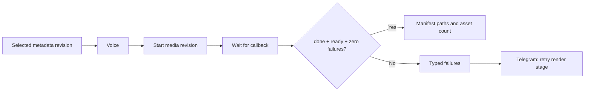

# n8n media-revision integration - Step 2

Status: canonical workflow verified; live import pending  
Verified: 2026-09-10

## Result

The inactive canonical workflow now calls `/media-revision/jobs` after voice
generation. The legacy `/render/jobs` endpoint remains available for older
callers, but it is no longer part of the canonical pipeline.

## Revision and recovery contract

- The metadata revision number becomes the stable integer `render_revision`.
- The metadata revision UUID is retained as manifest lineage.
- The current mock pipeline selects `mock-brand`; future app handoff supplies
  durable brand selections and campaign revisions.
- A success branch requires job state `done`, manifest state `ready`, and
  `failure_count = 0`.
- The workflow carries `manifest_path`, immutable `revision_manifest_path`, and
  `asset_count`; it does not carry the legacy ambiguous `processed_path`.
- Typed failures reach the operator with a `Retry render stage` action. The
  renderer re-probes and reuses valid peers on the same revision.

## Evidence

- Canonical workflow contract: 11 tests passed.
- Metadata-service Docker suite: 38 tests passed.
- Render-service model-free Docker suite: 48 passed, 59 deselected.
- Production endpoint job `ab1397127dec471a8a1365480b86c069` produced ready
  render revision 4 with four correctly probed assets and zero failures.
- `test_corrupt_brand_asset_retry_reuses_verified_peers` damaged branded
  `part_2`, retried the same revision, and proved the five valid peers kept
  their original modification times.
- An isolated n8n CLI import succeeded with one inactive 36-node workflow. The
  disposable container used `/tmp/reup-step2-isolated` and did not mount the
  external `n8n_data` volume.

## Live boundary

The live n8n database was not imported, changed, or activated. Import remains
a separate explicitly authorized operation after reviewing the canonical JSON.
