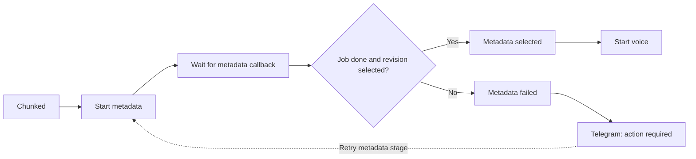

# n8n metadata integration - Step 2

Status: canonical workflow verified; live import pending  
Verified: 2026-09-10

## Result

The reviewed canonical workflow now requires selected metadata before voice
and rendering can begin. The inactive live workflow was exported and compared
first, but it was not imported, modified, or activated.

## Success contract

- n8n submits the video ID and a signed resume callback URL to the internal
  metadata service.
- The execution parks without holding an HTTP connection while metadata is
  generated.
- The success branch requires both `job.state = done` and
  `revision.state = selected`.
- The selected revision ID, estimated campaign cost, and warnings continue to
  the voice and render stages.
- The OpenAI API key and selected model remain inside the metadata service;
  neither is embedded in the workflow JSON.

## Failure and recovery contract

- Exhausted or non-retryable failures enter a typed `Metadata failed` state.
- Telegram uses the original source chat ID and tells the operator to retry
  the metadata stage.
- Successful peer metadata is retained, so selective retry does not regenerate
  already valid items.
- Duplicate active submissions reuse the existing metadata job.
- A transcript, prompt, schema, or model change creates a new revision and
  makes affected prior render inputs stale.
- The `$0.02` campaign estimate is a warning threshold, not a kill switch.

## Live and canonical difference

| Copy | Nodes | Active | Important difference |
| --- | ---: | --- | --- |
| Live n8n database | 30 | No | No metadata gate; invalid-input Telegram node still uses the older chat-ID expression. |
| Canonical Git candidate | 36 | No | Six-node metadata gate plus the corrected source chat-ID expression. |

Because the JSON file and n8n database do not synchronize automatically, the
new nodes will not appear in the editor until the canonical candidate is
explicitly reviewed and imported.

## Verification evidence

- Metadata-service Docker tests: `36 passed`.
- Shared callback regression tests: `2 passed`.
- Canonical workflow contract tests: `7 passed`.
- Isolated n8n CLI import: successful with 36 nodes and `active: false`; it used
  a temporary n8n user folder and did not touch the external `n8n_data` volume.
- Live model fixture: one whole-video result plus three chunk results passed at
  an estimated `$0.003704` using `gpt-5.6-luna` with
  `reasoning.effort: none`.

## Next safe action

Review the six-node difference, then explicitly import the canonical workflow
into the inactive live n8n database. Activation and real execution remain
separate decisions.
