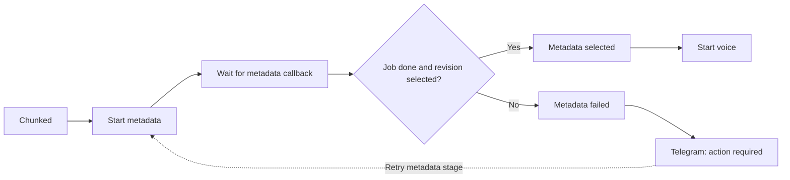

# n8n metadata integration - Step 2

Status: canonical and live inactive workflow verified
Verified: 2026-09-11

## Result

The reviewed canonical workflow now requires selected metadata before voice
and rendering can begin. After a pre-import export, it was imported in place
into the existing live workflow and re-exported. It remains inactive and keeps
its original identity and credential references.

## Success contract

- n8n submits the video ID and a signed resume callback URL to the internal
  metadata service.
- The execution parks without holding an HTTP connection while metadata is
  generated.
- The success branch requires both `job.state = done` and
  `revision.state = selected`.
- The selected revision ID, estimated campaign cost, and warnings continue to
  the voice and render stages.
- The OpenAI API key and selected model remain inside the metadata service;
  neither is embedded in the workflow JSON.

## Failure and recovery contract

- Exhausted or non-retryable failures enter a typed `Metadata failed` state.
- Telegram uses the original source chat ID and tells the operator to retry
  the metadata stage.
- Successful peer metadata is retained, so selective retry does not regenerate
  already valid items.
- Duplicate active submissions reuse the existing metadata job.
- A transcript, prompt, schema, or model change creates a new revision and
  makes affected prior render inputs stale.
- The `$0.02` campaign estimate is a warning threshold, not a kill switch.

## Live and canonical state

| Copy | Nodes | Active | Important difference |
| --- | ---: | --- | --- |
| Live n8n database | 36 | No | Imported metadata gate and corrected source chat-ID expression. |
| Canonical Git workflow | 36 | No | Matches the tested live workflow contract. |

The JSON file and n8n database still do not synchronize automatically. Future
workflow edits must begin with a fresh live export and comparison.

## Verification evidence

- Metadata-service Docker tests: `36 passed`.
- Shared callback regression tests: `2 passed`.
- Canonical workflow metadata/media contract tests: `11 passed`.
- The live post-import export passed the same `11` contract tests.
- Isolated n8n CLI import: successful with 36 nodes and `active: false`; it used
  a temporary n8n user folder and did not touch the external `n8n_data` volume.
- Live model fixture: one whole-video result plus three chunk results passed at
  an estimated `$0.003704` using `gpt-5.6-luna` with
  `reasoning.effort: none`.

## Next boundary

The user accepted the inactive import and contract evidence for Step 2. A live
external execution with possible Telegram effects remains deferred to the
signed handoff milestone in Step 4.
