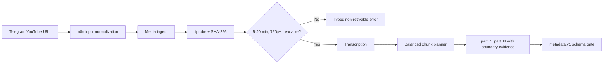

# Step 2 progress - source preflight and balanced chunks

Status: in progress  
Verified: 2026-09-10

## Completed slice



Implemented:

- Source policy checks for inclusive 5:00-20:00 duration, 720p minimum, and
  readable video.
- `ffprobe` measurement and SHA-256 identity before transcription.
- Additive SQLite migration for source hash, dimensions, validation
  status/error code, chunk name, and boundary shift.
- Typed recovery payloads such as `duration_out_of_range`,
  `resolution_too_low`, and `media_corrupt`.
- Balanced chunk planning using video duration, including silent intro/outro,
  with transcript-safe boundaries no more than 15 seconds from the target.
- Stable names `part_1`, `part_2`, and so on.
- Canonical n8n input parsing forwards the first URL to media-service. The file
  was deliberately not imported into the live database.
- Strict normalization for YouTube `watch`, `youtu.be`, `shorts`, `embed`, and
  `live` URLs, including rejection of malformed and lookalike hosts.
- A healthy Docker metadata-service with strict versioned schemas for YouTube
  and per-chunk visual/Facebook/TikTok copy. It does not call OpenAI yet.

## Verification

- Media-service source validation and URL normalization: `21 passed` inside
  Docker.
- Whisper balanced chunk unit subset: `12 passed` inside Docker.
- Metadata structured-output schemas: `10 passed` inside Docker.
- Reference results: 5:00 -> 1, 9:00 -> 1, 10:00 -> 2,
  13:42 -> 3, 20:00 -> 4.
- Installed SQLite database was migrated in place; existing `n8n_data` was not
  recreated or deleted.
- `docker compose config --quiet` passed.
- `media-service`, `metadata-service`, `whisper-transcript-service`, and `n8n`
  reported healthy.

## Important recovery behavior

Accepted Telegram input:

```text
https://youtu.be/VIDEO_ID
```

No rights marker or additional data field is required.

## Remaining Step 2 work

- Durable duplicate-active, resume-existing, and force-new-campaign actions.
- OpenAI Responses API generation, provenance/selective retry, and n8n metadata
  job/wait/validation nodes.
- Cost fixture and final model/budget record.
- Clean 1920x1080 whole render and clean 1080x1920 chunk renders.
- Mock-brand watermark/signature-music variants.
- Versioned manifest with `ffprobe`, streams, hashes, warnings, and completion gate.
- Docker end-to-end fixtures and representative frame inspection.
