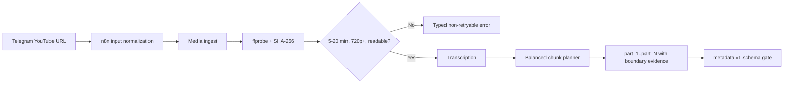

# Step 2 progress - source preflight and balanced chunks

Status: in progress - see "Remaining Step 2 work"
Verified: 2026-09-11

Renderer topology, encoder selection, campaign recovery, and the fixture
strategy are covered in detail in
`reports/step2-renderer-and-campaign-recovery.md`.

## Completed slice



Implemented:

- Source policy checks for inclusive 5:00-20:00 duration, 720p minimum, and
  readable video.
- `ffprobe` measurement and SHA-256 identity before transcription.
- Additive SQLite migration for source hash, dimensions, validation
  status/error code, chunk name, and boundary shift.
- Typed recovery payloads such as `duration_out_of_range`,
  `resolution_too_low`, and `media_corrupt`.
- Balanced chunk planning using video duration, including silent intro/outro,
  with transcript-safe boundaries no more than 15 seconds from the target.
- Stable names `part_1`, `part_2`, and so on.
- Canonical n8n input parsing forwards the first URL to media-service.
- Strict normalization for YouTube `watch`, `youtu.be`, `shorts`, `embed`, and
  `live` URLs, including rejection of malformed and lookalike hosts.
- A healthy Docker metadata-service with strict versioned schemas for YouTube
  and per-chunk visual/Facebook/TikTok copy.
- Durable metadata revisions, independent YouTube/chunk result selection,
  deterministic transcript/prompt/schema/model keys, bounded selective retry,
  restart recovery, and response/token provenance.
- Duplicate active metadata submissions reuse one job. New transcript/model/
  prompt revisions mark the prior metadata stale and invalidate old chunk
  renders. Selected visual hook/caption fields are handed to the renderer;
  Facebook and TikTok copy stays separately versioned.
- Metadata prompt version `metadata.vi.v2` treats transcripts as untrusted data
  rather than instructions. Deterministic validation rejects non-Vietnamese
  output signals, generated URLs, malformed JSON, wrong chunk identities,
  invalid hashtag groups, excess emojis, and unknown fields.
- The selected model is `gpt-5.6-luna`; it is configured only in the metadata
  service. The API key remains in the server-only root `.env` source.
- The updated API project exposes `gpt-5.6-luna`. A live one-result fixture and
  a read-only whole-video plus three-chunk fixture passed. The representative
  run used 10,048 input and 1,412 output tokens (`$0.003704` estimated) with
  `reasoning.effort: none`.
- Canonical n8n metadata integration adds six nodes between `Chunked` and
  `Start voice`: start, wait, two-condition validity gate, selected state,
  typed failure state, and operator-action Telegram notification.
- Metadata jobs calculate token cost using configured Luna rates and add a
  soft warning at `$0.02`; the warning never stops a campaign mid-generation.
- Versioned `media-manifest.v1` schema, deterministic revision-scoped asset
  IDs, safe clean/branded paths, immutable revision files, and an atomic
  current-manifest pointer.
- Real `ffprobe`/SHA-256 validation primitives reject missing or empty files,
  missing audio/video streams, wrong 16:9 or 9:16 dimensions, duration drift,
  and non-H.264/AAC output before a revision can become ready.
- Direct clean YouTube renderer and `yt-landscape` preset produce 1920x1080
  from the complete `raw.mp4`, with Vietnamese voice and burned subtitles,
  without concatenating vertical chunks.
- Revisioned `/media-revision/jobs` production path produces the complete
  clean/branded manifest topology independently of the legacy `/render/jobs`
  endpoint.
- Clean vertical chunk masters are written as
  `outputs/clean/revision/<render_revision>/vertical/part_<n>-9x16.mp4`.
- Mock-brand derivation writes brand-owned 16:9 and 9:16 variants with a
  configured watermark and local signature-music bed.
- Same-brand Facebook and TikTok can reuse the same branded vertical file
  because branded vertical paths are keyed by brand, revision, and part, not by
  platform.
- Safe same-revision retry reuses the immutable ready manifest and already
  verified assets instead of re-encoding.
- The canonical n8n render stage now calls `/media-revision/jobs` with the
  stable metadata revision number, metadata revision UUID, and mock brand.
  Completion requires `done`, a `ready` manifest, and zero typed failures.
- Mock signature music now uses the fixture-calibrated `-24 dB` base bed with
  speech-aware `8:1` compression, `20 ms` attack, `450 ms` release, looping,
  and `0.75 s`/`1.0 s` edge fades.
- The reviewed canonical workflow is imported in place into the existing live
  n8n workflow. Identity, credentials, and `active: false` are preserved. Dated
  pre-import and post-import exports are stored under
  `artifacts/n8n-backups/`.
- Verified hardware encoder selection. The render service probes the preferred
  encoder with a real short encode before using it, and records the requested
  encoder, the selected encoder, whether it is hardware, and a typed
  `fallback_reason` on the job result and on `/health`. CPU fallback is never
  silent.
- Durable campaign control plane in PostgreSQL: `SourceVideo`, `Campaign`,
  `CampaignRevision`, `ProcessingAttempt`, and append-only `CampaignEvent`.
- Durable resume and force-new actions with database-enforced guarantees: at
  most one live campaign per source, at most one attempt per resume intent, one
  campaign per force-new intent, gapless audit history, and immutable frozen
  revisions. Resume keeps campaign identity and reuses verified assets;
  force-new opens a distinct campaign and leaves the retired campaign's
  history and artifacts intact.

## Verification

- Media-service source validation and URL normalization: `21 passed` inside
  Docker.
- Whisper balanced chunk unit subset: `12 passed` inside Docker.
- Metadata service schemas, Responses request contract, revision persistence,
  selective retry, cached reuse, transcript-change invalidation, and restart
  recovery, duplicate-job reuse, safe renderer handoff, and 1/3/4-chunk
  fixtures, typed API failures, and soft cost warnings: `36 passed` inside
  Docker. The current full metadata-service suite is `38 passed`. Shared
  callback regression tests: `2 passed`.
- Canonical workflow metadata/media contract: `11 passed` against the canonical
  file, and `11 passed` again against the workflow re-exported from the live
  database after import. The persisted live workflow has 36 nodes, keeps its
  original workflow id and credential references, and is still `active: false`.
- Render-service manifest, landscape, concat, and voice-pool Docker subset:
  `40 passed`.
  The manifest cases generate short real FFmpeg media and inspect it with real
  `ffprobe`.
- Render-service media-revision subset: `23 passed` for `test_manifest.py`,
  `test_clean_landscape.py`, and `test_clean_vertical_and_brand.py`.
- Render-service model-free contract suite: `48 passed, 59 deselected` with
  `pytest -q -m no_pipeline`.
- Corrupt-asset recovery damaged one branded `part_2`, retried the same
  revision, and reused all five verified peers without changing their file
  modification times.
- The music calibration fixture measured ducking during narration, recovery in
  a speech gap, looping beyond the source music duration, both edge fades, and
  preserved narration level.
- The existing 19-second fixture produced H.264 1920x1080 plus AAC audio and
  was visually inspected at six seconds for preserved aspect ratio and readable
  Vietnamese subtitles.
- The 19-second fixture also passed the new production endpoint:
  `/media-revision/jobs` job `f4f842d3e00c4288a3c5fa464351ed94`, render
  revision 3, state `ready`, 4 assets, 0 failures. It wrote a clean whole
  asset, a clean `part_1` vertical asset, a branded whole asset, and a branded
  `part_1` vertical asset. Same-revision retry job
  `cd9b3b170c204875afcfc59ece35c068` reused the ready manifest.
- After ducking calibration, production endpoint job
  `ab1397127dec471a8a1365480b86c069` produced render revision 4 as `ready`:
  four H.264/AAC assets, correct 1920x1080 and 1080x1920 dimensions, and zero
  failures.
- Representative frame evidence:
  `reports/step2-revision3-branded-whole-frame.jpg` and
  `reports/step2-revision3-branded-part1-frame.jpg`.
- Reference results: 5:00 -> 1, 9:00 -> 1, 10:00 -> 2,
  13:42 -> 3, 20:00 -> 4. Measured in the live container against the real
  planner. These verify chunk topology only, not the encodes.
- Encoder selection unit suite: `18 passed` inside Docker. Live render-service
  `/health` reports `requested_encoder h264_nvenc`, `selected_encoder
  h264_nvenc`, `hardware true`, `fallback_reason null`, and a real one-frame
  encode inside the container opened `h264_nvenc` successfully.
- Long-source revision evidence: source `3gi_15UH9fQ` at `682.841 s`
  (`11:23`), 3 chunks, manifest `/data/3gi_15UH9fQ/manifests/revision/1.json`
  state `ready` with `8 assets` and `0 failures`. Two of the eight are
  full-length `682.84 s` 1920x1080 encodes, confirming the YouTube asset is an
  independent whole-source render rather than a concatenation of chunks.
- Campaign resume and force-new: `35 passed, 0 failed` across 7 suites
  (`node --test tests/campaigns.test.mjs`), run against the real PostgreSQL
  schema rather than a mock. Includes two cases that assert the unique indexes
  reject duplicates at the database level.
- Campaign HTTP path verified against a running server on `127.0.0.1:3000`:
  start returns `201`; the same source returns `200 live_campaign_exists` with
  the same id; resume returns `resumed true`; a second resume returns
  `resumed false already_running` with the same attempt id; two parallel resume
  requests produce `resumed` flags `[true, false]` and exactly one attempt;
  force-new returns `201` with ordinal 2; a second force-new returns `200
  already_replaced`; resume on a superseded campaign returns `409
  campaign_not_resumable`; and the retired campaign keeps its ordinal, its
  revision, its attempt, and its full event chain
  `campaign_created -> campaign_resumed -> campaign_superseded`.
- Prisma migration applied with `migrate deploy` after baselining. Row counts
  before and after are identical: `User=2`, `ScheduledPost=1`, `Account=1`,
  `Session=1`. All test and HTTP rows were cleaned up afterwards.
- `npm run build` compiled successfully and registered `/api/campaigns`,
  `/api/campaigns/[id]`, `/api/campaigns/[id]/resume`, and
  `/api/campaigns/[id]/force-new`.
- Installed SQLite database was migrated in place; existing `n8n_data` was not
  recreated or deleted.
- `docker compose config --quiet` passed.
- `media-service`, `metadata-service`, `whisper-transcript-service`, and `n8n`
  reported healthy.

## Important recovery behavior

Accepted Telegram input:

```text
https://youtu.be/VIDEO_ID
```

No rights marker or additional data field is required.

## Remaining Step 2 work

- Full-length renders at 5:00, 9:00, 10:00, 13:42, and 20:00 were not executed.
  Verification is layered instead: chunk-topology contract tests for every
  duration in the matrix, short real-FFmpeg asset tests, and one representative
  `682.841 s` run that reached a `ready` manifest. This is an accepted,
  documented limitation - the chunk counts are verified, the encodes at those
  durations are not.
- The chunk planner has an unreachable band. No chunk count satisfies
  `240-300 s` for sources between `601 s` and `719 s`; the `abs(average - 270)`
  tie-break resolves it, giving 3 chunks averaging `227.6 s` at `682.841 s`.
  This needs a product decision, not a code fix.
- The campaign control plane is not yet wired into the n8n stages. The models,
  domain layer, and HTTP endpoints exist and are tested, but n8n does not call
  them yet, so campaign rows are still created by tests and by direct API calls
  rather than by the pipeline.
- Legacy pipeline row `eL7f4oHqj5Q` (`775.0 s`, stage `chunked`, validation
  `pending`) has 4 stored chunks while the current planner returns 3. It
  predates the planner and was left untouched.

## Corrected earlier claims

- The previous note that the 11-minute source "falls back to CPU `libx264` and
  is too slow" was wrong on both halves. NVENC was genuinely unavailable
  because the container lacked the `video` driver capability, and CPU `libx264`
  measured only about `1.45x` slower than `h264_nvenc` on that source, with
  both finishing in under four minutes. The `11 minutes` in that note was the
  source duration, not the render time.
- The source is `682.841 s` (`11:23`), so it should be described by its
  measured duration rather than as a round "11-minute fixture".
