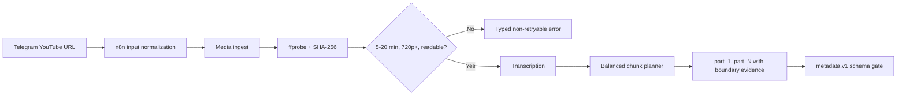

# Step 2 progress - source preflight and balanced chunks

Status: in progress  
Verified: 2026-09-10

## Completed slice



Implemented:

- Source policy checks for inclusive 5:00-20:00 duration, 720p minimum, and
  readable video.
- `ffprobe` measurement and SHA-256 identity before transcription.
- Additive SQLite migration for source hash, dimensions, validation
  status/error code, chunk name, and boundary shift.
- Typed recovery payloads such as `duration_out_of_range`,
  `resolution_too_low`, and `media_corrupt`.
- Balanced chunk planning using video duration, including silent intro/outro,
  with transcript-safe boundaries no more than 15 seconds from the target.
- Stable names `part_1`, `part_2`, and so on.
- Canonical n8n input parsing forwards the first URL to media-service. The file
  was deliberately not imported into the live database.
- Strict normalization for YouTube `watch`, `youtu.be`, `shorts`, `embed`, and
  `live` URLs, including rejection of malformed and lookalike hosts.
- A healthy Docker metadata-service with strict versioned schemas for YouTube
  and per-chunk visual/Facebook/TikTok copy.
- Durable metadata revisions, independent YouTube/chunk result selection,
  deterministic transcript/prompt/schema/model keys, bounded selective retry,
  restart recovery, and response/token provenance.
- Duplicate active metadata submissions reuse one job. New transcript/model/
  prompt revisions mark the prior metadata stale and invalidate old chunk
  renders. Selected visual hook/caption fields are handed to the renderer;
  Facebook and TikTok copy stays separately versioned.
- Metadata prompt version `metadata.vi.v2` treats transcripts as untrusted data
  rather than instructions. Deterministic validation rejects non-Vietnamese
  output signals, generated URLs, malformed JSON, wrong chunk identities,
  invalid hashtag groups, excess emojis, and unknown fields.
- The selected model is `gpt-5.6-luna`; it is configured only in the metadata
  service. The API key remains in the server-only root `.env` source.
- The updated API project exposes `gpt-5.6-luna`. A live one-result fixture and
  a read-only whole-video plus three-chunk fixture passed. The representative
  run used 10,048 input and 1,412 output tokens (`$0.003704` estimated) with
  `reasoning.effort: none`.
- Canonical n8n metadata integration adds six nodes between `Chunked` and
  `Start voice`: start, wait, two-condition validity gate, selected state,
  typed failure state, and operator-action Telegram notification.
- Metadata jobs calculate token cost using configured Luna rates and add a
  soft warning at `$0.02`; the warning never stops a campaign mid-generation.
- Versioned `media-manifest.v1` schema, deterministic revision-scoped asset
  IDs, safe clean/branded paths, immutable revision files, and an atomic
  current-manifest pointer.
- Real `ffprobe`/SHA-256 validation primitives reject missing or empty files,
  missing audio/video streams, wrong 16:9 or 9:16 dimensions, duration drift,
  and non-H.264/AAC output before a revision can become ready.
- Direct clean YouTube renderer and `yt-landscape` preset produce 1920x1080
  from the complete `raw.mp4`, with Vietnamese voice and burned subtitles,
  without concatenating vertical chunks.
- Revisioned `/media-revision/jobs` production path produces the complete
  clean/branded manifest topology independently of the legacy `/render/jobs`
  endpoint.
- Clean vertical chunk masters are written as
  `outputs/clean/revision/<render_revision>/vertical/part_<n>-9x16.mp4`.
- Mock-brand derivation writes brand-owned 16:9 and 9:16 variants with a
  configured watermark and local signature-music bed.
- Same-brand Facebook and TikTok can reuse the same branded vertical file
  because branded vertical paths are keyed by brand, revision, and part, not by
  platform.
- Safe same-revision retry reuses the immutable ready manifest and already
  verified assets instead of re-encoding.

## Verification

- Media-service source validation and URL normalization: `21 passed` inside
  Docker.
- Whisper balanced chunk unit subset: `12 passed` inside Docker.
- Metadata service schemas, Responses request contract, revision persistence,
  selective retry, cached reuse, transcript-change invalidation, and restart
  recovery, duplicate-job reuse, safe renderer handoff, and 1/3/4-chunk
  fixtures, typed API failures, and soft cost warnings: `36 passed` inside
  Docker. Shared callback regression tests: `2 passed`.
- Canonical workflow metadata contract: `7 passed`; isolated n8n CLI import:
  successful with 36 nodes and `active: false`.
- Render-service manifest, landscape, concat, and voice-pool Docker subset:
  `40 passed`.
  The manifest cases generate short real FFmpeg media and inspect it with real
  `ffprobe`.
- Render-service media-revision subset: `20 passed` for `test_manifest.py`,
  `test_clean_landscape.py`, and `test_clean_vertical_and_brand.py`.
- Render-service model-free contract suite: `45 passed, 59 deselected` with
  `pytest -q -m no_pipeline`.
- The existing 19-second fixture produced H.264 1920x1080 plus AAC audio and
  was visually inspected at six seconds for preserved aspect ratio and readable
  Vietnamese subtitles.
- The 19-second fixture also passed the new production endpoint:
  `/media-revision/jobs` job `f4f842d3e00c4288a3c5fa464351ed94`, render
  revision 3, state `ready`, 4 assets, 0 failures. It wrote a clean whole
  asset, a clean `part_1` vertical asset, a branded whole asset, and a branded
  `part_1` vertical asset. Same-revision retry job
  `cd9b3b170c204875afcfc59ece35c068` reused the ready manifest.
- Representative frame evidence:
  `reports/step2-revision3-branded-whole-frame.jpg` and
  `reports/step2-revision3-branded-part1-frame.jpg`.
- Reference results: 5:00 -> 1, 9:00 -> 1, 10:00 -> 2,
  13:42 -> 3, 20:00 -> 4.
- Installed SQLite database was migrated in place; existing `n8n_data` was not
  recreated or deleted.
- `docker compose config --quiet` passed.
- `media-service`, `metadata-service`, `whisper-transcript-service`, and `n8n`
  reported healthy.

## Important recovery behavior

Accepted Telegram input:

```text
https://youtu.be/VIDEO_ID
```

No rights marker or additional data field is required.

## Remaining Step 2 work

- Durable resume-existing and force-new-campaign actions outside the metadata
  stage. Duplicate active metadata job reuse is implemented and tested.
- Explicitly reviewed import of the 36-node canonical JSON into the inactive
  live workflow. It was not imported automatically.
- Full-length 5-, 9-, 10-, 13:42-, and 20-minute render fixture matrix. The
  short production endpoint and two-part automated fixture are verified; the
  11-minute run on this host falls back to CPU `libx264` and is too slow for a
  routine turn.
- Wire the new media-revision endpoint into the reviewed canonical n8n JSON and
  explicitly review/import the inactive live workflow when ready.
- Calibrate signature-music loudness, speech ducking, looping, and fades
  against representative fixtures. Current mock mix is intentionally
  provisional and emits a warning.
