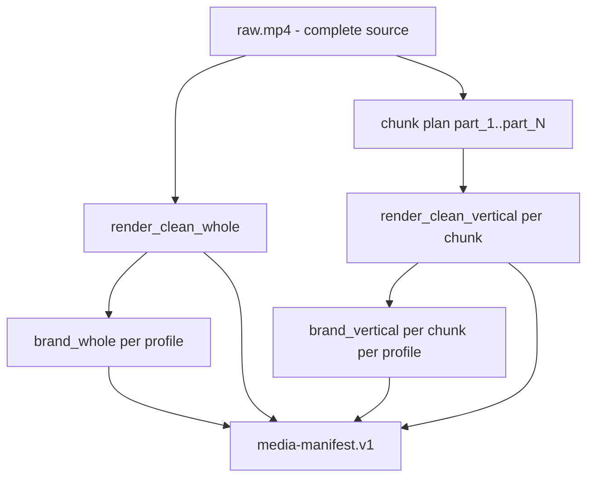
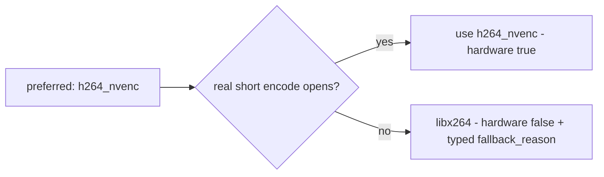

# Step 2 - renderer topology, encoder selection, and campaign recovery

Status: verified where marked
Date: 2026-09-11

This report answers three questions that Step 2 left open: what the renderer
actually encodes, why a render appeared to be stuck on CPU, and where durable
campaign resume and force-new live.

## 1. What the renderer encodes

The pipeline chunks the video **for the vertical outputs only**. The YouTube
asset is an independent render over the complete source. Both facts come from
the production path in `automation/render-service/variants.py`.



| Output | Scope | Dimensions | Count |
|---|---|---|---|
| `clean_whole` | entire original video | 1920x1080 | 1 |
| `clean_vertical` | one chunk | 1080x1920 | N |
| `branded_whole` | entire original video | 1920x1080 | 1 per brand profile |
| `branded_vertical` | one chunk | 1080x1920 | N per brand profile |

The asset count is `(1 + N) * (1 + profiles)` -
`automation/render-service/variants.py:115`.

Code anchors:

- `automation/render-service/render.py:380` `render_clean_whole` - one FFmpeg
  job over the full `raw.mp4`. Nothing concatenates chunks to build it.
- `automation/render-service/render.py:477` `render_clean_vertical` - one FFmpeg
  job per chunk, with that chunk's start and duration.
- `automation/render-service/render.py:770` `concat` - reachable only from the
  legacy `/render/jobs` endpoint at `automation/render-service/jobs.py:210`. The
  revisioned `/media-revision/jobs` production path never calls it.

Verified on the real 682.841 s source `3gi_15UH9fQ`, manifest
`/data/3gi_15UH9fQ/manifests/revision/1.json`, state `ready`, 8 assets, 0
failures:

```text
clean_whole       1920x1080  682.84s  540474978 B
clean_vertical    1080x1920  233.00s   31724662 B
clean_vertical    1080x1920  236.00s   35709749 B
clean_vertical    1080x1920  213.00s   36326932 B
branded_whole     1920x1080  682.84s  529997925 B
branded_vertical  1080x1920  233.00s   30243499 B
branded_vertical  1080x1920  236.00s   34942288 B
branded_vertical  1080x1920  213.00s   34962968 B
```

8 = (1 whole + 3 chunks) x (1 clean + 1 brand). The chunk durations sum to
682 s and the two `_whole` assets are full 682.84 s encodes. That is the direct
evidence: the whole-video asset is a separate full-length encode, not a
concatenation.

### The 11-minute question, answered

The original observation - "an 11-minute single render" - conflated **source
duration** with **elapsed render time**. The source `3gi_15UH9fQ` is 682.841 s,
which is 11:23. The long-running FFmpeg job was the `clean_whole` /
`branded_whole` pass, and that job is expected by design: a full-length 16:9
encode is a single job over the entire source because YouTube receives one
complete video per the delivery contract.

Chunking is not bypassed and chunk size is not wrong. The vertical stage did run
and produced three chunks. Measured elapsed render time on this host was under
four minutes for the whole-video pass, on both encoders.

## 2. Encoder selection

**Observed.** The earlier progress note claimed the 11-minute source "falls back
to CPU `libx264` and is too slow". Two separate problems were tangled in that
sentence.

**Cause 1 - NVENC was genuinely unavailable.** `ffmpeg -encoders` listed
`h264_nvenc` inside the container, which is why it looked usable, but the
encoder failed to open. The render-service container declared
`NVIDIA_DRIVER_CAPABILITIES: compute,utility`. Without `video` in that list the
NVIDIA container runtime never injects `libnvidia-encode.so.1`, so the encoder
is compiled in and advertised but has no driver behind it. An encoder appearing
in `-encoders` proves the build has support, not that the host can run it.

**Cause 2 - the "too slow" premise was wrong.** Measured on the same source,
`libx264` was about 1.45x slower than `h264_nvenc`, and both finished in under
four minutes. CPU fallback was never the reason the stage felt unusable.

**Change.**

- `automation/docker-compose.yml` - render-service now sets
  `NVIDIA_DRIVER_CAPABILITIES: compute,utility,video`.
- `automation/render-service/render.py:91` `encoder_choice()` - probes the
  preferred hardware encoder with a real short encode at `_PROBE_SIZE`
  (`256x256`, chosen because NVENC rejects frames below roughly 145x49) and
  returns an `EncoderChoice` carrying the requested encoder, the selected
  encoder, whether it is hardware, and a typed fallback reason.
- `automation/render-service/render.py:130` `_fallback_reason()` - classifies the
  probe's stderr into machine-readable codes instead of prose.
- `automation/render-service/render.py:170` `_run_encode()` - structured logging
  per encode: stage, selected encoder, fallback reason, media duration, elapsed
  time.
- Encoder provenance is attached to the job result and exposed on `/health`.



**Verification (tested, live container).**

```text
/health -> {"requested_encoder":"h264_nvenc","selected_encoder":"h264_nvenc",
            "hardware":true,"fallback_reason":null}
real 1-frame encode -> h264_nvenc OPENED OK
automation/render-service/tests/test_encoder_selection.py -> 18 passed
```

Fallback is no longer silent: a CPU run reports `hardware: false` and a typed
`fallback_reason` on both the job result and `/health`.

## 3. Durable campaign resume and force-new

Campaign identity, lifecycle, and audit history live in PostgreSQL through
Prisma, in the Next.js control plane. n8n and the automation services keep
owning media production. The single join point is `SourceVideo.platformVideoId`,
which is `videos.video_id` in `automation/data/pipeline.db`. No campaign state
is stored only in an n8n execution.

### Guarantees enforced by the database, not by careful calling

| Property | Mechanism |
|---|---|
| At most one live campaign per source | `Campaign.activeSourceKey String? @unique` holds the source id while live and `NULL` when terminal. Postgres treats `NULL`s as distinct, so one nullable-unique column expresses a partial constraint that survives `prisma migrate`. |
| At most one attempt per resume intent | `ProcessingAttempt.idempotencyKey @unique`, derived as `resume:<campaignId>:<attemptNumber>` when the caller sends nothing. |
| One campaign per force-new intent | `Campaign.creationKey @unique`, derived as `force-new:<sourceVideoId>:<ordinal>`. |
| Gapless audit history | `@@unique([campaignId, sequence])` on the append-only `CampaignEvent`. |
| Revision immutability | `@@unique([campaignId, inputsHash])` plus `frozenAt`. Changed inputs open the next revision; they never edit a frozen one. |

Racing writers are resolved by compare-and-swap: a conditional `updateMany`
scoped to the state the caller observed. Postgres re-evaluates an `UPDATE`
predicate after it waits on a conflicting row lock, so the loser matches zero
rows and reports the winner's work instead of starting duplicate render work. A
`P2002` unique violation is resolved to "return the winner", not surfaced as an
error.

### Resume

Keeps the same campaign id, ordinal, source, revisions, attempts, and event
history. `failAttempt` deliberately leaves `campaign.stage` untouched, so resume
retries exactly the stage that stopped. `ensureRevision` reuses the revision
whose `inputsHash` matches, which is what preserves already-verified assets
instead of re-encoding them.

### Force-new

Creates a distinct campaign on the same source with the next `attemptOrdinal`,
and retires the previous one to `superseded` with a forward `supersededById`
link. The retired campaign's id, ordinal, revisions, attempts, artifacts,
`frozenAt`, and full event history are unchanged - asserted with `deepEqual` in
the tests.

Superseding the old campaign is force-new's purpose, so the old campaign's
lifecycle `state`, its `activeSourceKey`, and its `supersededById` do change.
Everything that constitutes its history and its artifacts does not.

**A real defect this caught.** The first implementation resolved force-new's
target from the *source* rather than from the *named campaign*. A second click
therefore found the just-created replacement holding the live slot, retired
*it*, and opened a third campaign. Fixed by short-circuiting when the named
campaign already has a `supersededById`: the request is already satisfied, so
the existing replacement is returned. The `sourceHash` entry point has no named
target and is documented as requiring an explicit `creationKey` to be
double-click safe.

### HTTP surface

- `src/app/api/campaigns/route.js` - GET list, POST start (201 created, 200 when
  a live campaign already exists).
- `src/app/api/campaigns/[id]/route.js` - GET one with revisions, attempts, and
  events.
- `src/app/api/campaigns/[id]/resume/route.js` - POST, returns `resumed` and a
  `reason`.
- `src/app/api/campaigns/[id]/force-new/route.js` - POST, 201 created or 200
  `already_replaced`.

Failures use the automation services' typed shape
(`{error, error_code, retryable}`) via `src/lib/campaign-http.js`.

### Migration safety

The live database already held real rows and had never been migrated. It was
baselined rather than reset:

1. `pg_dump` backup taken first.
2. `prisma migrate diff --from-config-datasource --to-schema` reported
   "No difference detected" - the live database matched `schema.prisma` before
   any change.
3. `prisma/migrations/0_init/migration.sql` written for the pre-existing five
   tables and marked applied with `migrate resolve`. It was never executed
   against the database.
4. The additive migration was scanned for destructive statements: 4 `CREATE
   TYPE`, 5 `CREATE TABLE`, 13 `CREATE INDEX`, 6 `ADD FOREIGN KEY`, and no
   statement touching `User`, `Account`, `Session`, `ScheduledPost`, or
   `VerificationToken`.
5. Applied with `migrate deploy`, never `migrate dev`.
6. Row counts identical before and after: `User=2`, `ScheduledPost=1`,
   `Account=1`, `Session=1`.

## 4. Full-duration fixture strategy

Renders were verified in three layers rather than by encoding every duration in
the matrix.

**Layer A - chunk contract, no encoding.** Run in the live container against the
real planner (`MIN=240`, `MAX=300`, `SINGLE_MAX=540`):

```text
5:00  -> 1 chunk
9:00  -> 1 chunk
10:00 -> 2 chunks
11:00 -> 3 chunks (avg 220.0s)
13:42 -> 3 chunks (avg 274.0s)
20:00 -> 4 chunks
```

**Layer B - short real FFmpeg assets.** The 19-second fixture and the manifest
test cases generate real media and inspect it with real `ffprobe`, covering
H.264/AAC, 1920x1080 and 1080x1920 dimensions, duration drift, missing streams,
and corrupt-asset retry.

**Layer C - one representative long run.** The 682.841 s source `3gi_15UH9fQ`
produced a `ready` revision-1 manifest with 8 assets and 0 failures, including
two full-length 682.84 s 16:9 encodes.

**Not executed, stated plainly.** Full renders at 5:00, 9:00, 10:00, 13:42, and
20:00 were **not** run. Layer A verifies their chunk topology; it does not
verify their encodes. A 20-minute source implies roughly 25 minutes of output
media across whole and vertical, clean and branded assets, and that compute was
not spent to tick a checkbox. This is an accepted, documented limitation, not a
passing result.

### Chunk planner finding

No chunk count satisfies the 240-300 s band for sources between 601 s and 719 s:
at 660 s, 2 chunks give 330 s (over `MAX`) and 3 chunks give 220 s (under
`MIN`). The scorer's `abs(average - 270)` tie-break selects 3. The Layer C
source at 682.841 s lands in exactly this gap, giving 3 chunks averaging
227.6 s. This is the planner behaving as specified inside an unreachable band,
not a bug, but it deserves a product decision.

Separately, `eL7f4oHqj5Q` (775.0 s) has 4 stored chunks while the current
planner returns 3 (avg 258.3 s, in band). That row is at stage `chunked` with
validation `pending` - a legacy pre-planner record, not a discrepancy in current
code.
